# Proyecto Final — Inteligencia Artificial 1

**Título:** Truco-AI: Agentes inteligentes para Truco Argentino (1v1, sin flor)  
**Autores:** Ramiro Martinez, Renzo Dávila  
**Fecha:** 12/02/2026
**Cátedra:** Inteligencia Artificial 1 - UNCUYO

---

## Índice

1. [Introducción](#1-introducción)
2. [Marco teórico](#2-marco-teórico)
   - [2.1 El Truco Argentino](#21-el-truco-argentino)
   - [2.2 Aprendizaje por refuerzo (RL)](#22-aprendizaje-por-refuerzo-rl)
   - [2.3 Políticas y evaluación de decisiones](#23-políticas-y-evaluación-de-decisiones)
   - [2.4 Estrategias de entrenamiento](#24-estrategias-de-entrenamiento)
   - [2.5 Q-Learning y Monte Carlo Q-Learning](#25-q-learning-y-monte-carlo-q-learning)
   - [2.6 PPO (Proximal Policy Optimization)](#26-ppo-proximal-policy-optimization)
3. [Diseño experimental](#3-diseño-experimental)
   - [3.1 Métricas](#31-métricas)
   - [3.2 Herramientas](#32-herramientas)
   - [3.3 Agentes utilizados](#33-agentes-utilizados)
   - [3.4 Creación del entorno personalizado](#34-creación-del-entorno-personalizado)
   - [3.5 Agentes y su implementación](#35-agentes-y-su-implementación)
4. [Resultados](#4-resultados)
   - [4.1 Experimentos y resultados internos](#41-experimentos-y-resultados-internos)
     - [4.1.1 Selección y ajuste de agente Q-Learning](#411-selección-y-ajuste-de-agente-q-learning)
     - [4.1.2 Selección y ajuste de agente PPO](#412-selección-y-ajuste-de-agente-ppo)
   - [4.2 Resultados globales](#42-resultados-globales)
     - [4.2.1 Resultados por agente](#421-resultados-por-agente)
     - [4.2.2 Visualización de resultados](#422-visualización-de-resultados)
5. [Análisis y discusión de resultados](#5-análisis-y-discusión-de-resultados)
   - [5.1 Agente Random](#51-agente-random)
   - [5.2 Agente Racional](#52-agente-racional)
   - [5.3 Agente Q-Learning](#53-agente-q-learning)
   - [5.4 Agente PPO](#54-agente-ppo)
6. [Conclusiones finales](#6-conclusiones-finales)
7. [Referencias](#7-referencias)

---

## 1. Introducción

El Truco Argentino es un juego de cartas tradicional de dos jugadores, por turnos y de información imperfecta. Cada jugador recibe un conjunto reducido de cartas y, a lo largo de la mano, debe decidir cómo y cuándo jugar, cuándo aceptar o rechazar desafíos y cómo interpretar las señales del rival. La partida combina mecánicas de enfrentamiento directo con un componente fuerte de toma de decisiones bajo incertidumbre, ya que las cartas del oponente son desconocidas y la información disponible se construye a partir de las jugadas, los cantos y el contexto de la mano. En términos generales, se trata de un juego competitivo donde la estrategia depende tanto de la evaluación de la mano propia como de la lectura del oponente.

En este tipo de juegos, los **agentes tradicionales** suelen basarse en reglas fijas o heurísticas diseñadas a mano, y a menudo incorporan **parámetros de estilo** (agresividad, frecuencia de mentira, tolerancia al riesgo, etc.). En lugar de aprender, estos agentes aplican reglas predefinidas para elegir acciones “razonables” con la información parcial disponible. Este enfoque produce comportamientos coherentes y explicables, pero tiene limitaciones: al no aprender de la experiencia, no se adapta de forma dinámica a oponentes o contextos nuevos. Por eso, estos agentes son una buena línea base para comparar con enfoques de **Reinforcement Learning**, que aprenden políticas de acción a partir de la interacción con el entorno.

El Truco es un candidato adecuado para aplicar RL porque presenta los elementos clásicos de un entorno de aprendizaje: decisiones secuenciales, recompensas claras (puntos ganados o perdidos) y un espacio de estados rico en incertidumbre. Además, su naturaleza de información imperfecta permite estudiar comportamientos de exploración, adaptación y modelado implícito del oponente. Sin embargo, también plantea desafíos: el estado observado es parcial, las recompensas pueden ser retrasadas y la dinámica de apuestas introduce componentes estratégicos difíciles de capturar con reglas simples. En este sentido, el Truco resulta interesante para RL, pero exige un diseño cuidadoso de la representación del estado, la función de recompensa y la evaluación experimental.

Este informe se organiza de la siguiente manera: primero se presenta el marco teórico necesario para entender el problema y las técnicas empleadas; luego se describe el diseño experimental, las métricas y herramientas utilizadas; más adelante se reportan los resultados obtenidos y su análisis; y finalmente se exponen las conclusiones y el trabajo futuro, junto con la bibliografía consultada.

---

## 2. Marco teórico

### 2.1 El Truco Argentino

El Truco Argentino [12] es un juego de cartas tradicional para dos jugadores (en la modalidad utilizada en este proyecto), de naturaleza competitiva y de información imperfecta. Se juega con un mazo español de 40 cartas (sin ochos ni nueves), y cada mano comienza con el reparto de tres cartas a cada jugador. La partida se juega a 30 puntos.

#### Estructura de una mano

Cada mano se compone de hasta tres **rondas**. En cada ronda, ambos jugadores juegan una carta y se comparan según una jerarquía de fuerza específica del juego. El jugador que gana dos de las tres rondas gana la mano. Si se producen empates (llamados **pardas**), se aplican reglas especiales: si la primera ronda empata, gana quien gane cualquiera de las siguientes; si la primera se gana y la segunda empata, gana quien ganó la primera; si las tres rondas empatan, gana el jugador que es **mano** (rol que alterna entre manos y determina quién juega primero).

#### Jerarquía de cartas

A diferencia de otros juegos de cartas, el Truco posee una jerarquía de fuerza no lineal que no sigue el orden numérico convencional. De mayor a menor fuerza, las cartas se ordenan así:

1 de Espadas → 1 de Bastos → 7 de Espadas → 7 de Oros → 3 → 2 → 1 (copas/oros) → 12 → 11 → 10 → 7 (copas/bastos) → 6 → 5 → 4

Esta jerarquía implica que un 3 supera a un 7 de copas, y que los ases de espadas y bastos son las cartas más poderosas del juego. Cada carta también posee un **valor de envido** independiente: los naipes del 1 al 7 contribuyen con su valor numérico, mientras que las figuras (10, 11, 12) contribuyen con cero.

#### El Truco (apuesta por la mano)

El **truco** es una apuesta sobre el resultado de la mano. En cualquier momento de su turno, un jugador puede **cantar truco**, desafiando al oponente a aceptar una apuesta de mayor valor. Las variantes escalan de la siguiente forma:

| Canto       | Puntos si gana | Puntos si rechaza |
| ----------- | -------------- | ----------------- |
| Sin canto   | 1              | —                 |
| Truco       | 2              | 1                 |
| Retruco     | 3              | 2                 |
| Vale cuatro | 4              | 3                 |

Cuando se canta truco, el oponente puede **aceptar** (quiero), **rechazar** (no quiero, entregando los puntos correspondientes) o **re-cantar** (elevar al siguiente nivel). Solo el jugador que aceptó el nivel anterior puede proponer la escalada siguiente. Si un jugador rechaza, la mano termina inmediatamente. Un jugador también puede **ir al mazo** (retirarse de la mano) en cualquier momento, cediendo los puntos en juego.

#### El Envido (apuesta por el tanto)

El **envido** es una apuesta que se resuelve comparando el **tanto** de cada jugador, calculado a partir de sus cartas en mano. Solo puede cantarse durante la primera ronda, antes de que se jueguen cartas o inmediatamente después de que se juegue la primera carta. El tanto se calcula así: si el jugador tiene dos o más cartas del mismo palo, suma 20 puntos de base más los valores de envido de las dos cartas de mayor valor en ese palo; en caso contrario, el tanto es igual al valor de envido de su carta más alta.

Las variantes del envido y su puntuación son:

| Canto         | Puntos si gana                  | Puntos si rechaza              |
| ------------- | ------------------------------- | ------------------------------ |
| Envido        | 2                               | 1                              |
| Envido-Envido | 4                               | 2                              |
| Real Envido   | 3,5 o 7 (segun envido previo)   | 1, 2 o 4 (segun envido previo) |
| Falta Envido  | 30 − puntos del ganador parcial | Puntos del nivel anterior      |

El envido-envido solo puede cantarse como respuesta a un envido simple. El real envido puede cantarse directamente o como escalada. La falta envido puede proponerse desde cualquier estado del envido. El envido tiene prioridad sobre el truco e incluso puede interrumpir un canto de truco si se realiza en el momento oportuno.

#### El rol de la mentira

Un aspecto estratégico central del Truco es que los cantos (tanto de truco como de envido) **no requieren que el jugador tenga cartas que justifiquen la apuesta**. Un jugador puede cantar truco con una mano débil o envido con un tanto bajo, apostando a que el rival rechazará y cederá puntos. Esta mecánica de **mentira** introduce un componente de engaño que diferencia al Truco de juegos puramente basados en la fuerza de las cartas.

### 2.2 Aprendizaje por refuerzo (RL)

El **aprendizaje por refuerzo** [9] es un paradigma de aprendizaje automático donde un **agente** interactúa con un **entorno** tomando **acciones** y recibiendo **recompensas**. El objetivo del agente es aprender una **política** que maximice el beneficio esperado en el tiempo. En el Truco, el entorno es el juego, las acciones corresponden a las decisiones posibles (jugar una carta, cantar, aceptar o rechazar), y la recompensa se asocia al resultado en puntos.

Un concepto central es la formulación como **Proceso de Decisión de Markov Parcialmente Observable (POMDP)** [9]. Formalmente, un POMDP se describe por:

- **S:** conjunto de estados reales.
- **A:** conjunto de acciones.
- **T(s'|s,a):** función de transición.
- **R(s,a):** recompensa.
- **O:** conjunto de observaciones.
- **Z(o|s',a):** modelo de observación.
- **γ:** factor de descuento.

En Truco, el estado completo incluye las cartas de ambos jugadores, pero el agente solo accede a una observación parcial (sus cartas e historial), lo que obliga a decidir bajo incertidumbre, integrando señales del rival y el contexto de la mano.

El Truco pertenece a la categoría de **juegos de suma cero** [10]: todo punto que un jugador gana es un punto que el otro pierde. Formalmente, la suma de las utilidades de ambos jugadores es constante en cada resultado posible (**u₁ + u₂ = 0**). Esta propiedad implica que los intereses de los jugadores son estrictamente opuestos, lo que convierte cada decisión en un problema de optimización competitiva donde mejorar el propio desempeño necesariamente empeora el del rival.

Además, al tratarse de un juego competitivo de dos jugadores, el análisis se vincula con nociones de **teoría de juegos**, como el **equilibrio de Nash** [10]. En términos generales, un perfil de estrategias **(π₁, π₂)** es un equilibrio de Nash si ninguna parte puede mejorar su resultado cambiando unilateralmente su estrategia, es decir:

- **u₁(π₁, π₂) ≥ u₁(π₁', π₂)**
- **u₂(π₁, π₂) ≥ u₂(π₁, π₂')**

para cualquier estrategia alternativa **π₁'** o **π₂'**. En juegos de suma cero, esta noción se relaciona con estrategias minimax, donde cada jugador busca minimizar la máxima ganancia posible del rival, lo que garantiza la protección contra la mejor respuesta del oponente.

En esta clase de problemas también es habitual restringir las **acciones válidas** en cada turno para mantener la coherencia con las reglas del juego. Estas restricciones permiten que el agente concentre su aprendizaje en decisiones legítimas, evitando estados imposibles. En conjunto, estas características hacen del Truco un dominio natural para RL: decisiones secuenciales, información parcial y un fuerte componente estratégico que depende tanto de la mano propia como de la interpretación del oponente.

### 2.3 Políticas y evaluación de decisiones

Una **política** define cómo decide el agente en función de lo que observa. Para comparar alternativas, se utilizan **criterios de evaluación** que estiman qué tan conveniente es una acción según las recompensas esperadas. Estas estimaciones permiten ordenar las decisiones disponibles y elegir la opción que, en promedio, conduce a mejores resultados. En un juego como el Truco, esta evaluación debe considerar que el efecto de una decisión puede manifestarse varios turnos después y que el rival influye activamente en el resultado.

---

### 2.4 Estrategias de entrenamiento

La calidad de un agente de aprendizaje por refuerzo depende en gran medida de los **oponentes** contra los cuales entrena. Un agente que solo entrena contra un oponente fijo tiende a sobreajustarse a esa estrategia particular, volviéndose vulnerable frente a rivales distintos. En juegos de dos jugadores como el Truco, la elección y diversificación de oponentes durante el entrenamiento es un factor crítico para desarrollar políticas robustas y generalizables.

#### Self-play

El **self-play** (auto-juego) es una técnica de entrenamiento donde el agente juega contra copias de sí mismo [15]. En lugar de requerir un oponente externo predefinido, el agente actúa simultáneamente como jugador y como rival, lo que genera un proceso de co-evolución: a medida que el agente mejora, su oponente (que es él mismo) también mejora, forzando una adaptación continua. Esta dinámica puede aproximar estrategias de equilibrio de Nash, ya que el agente debe aprender a responder a un oponente que utiliza exactamente su misma política.

El self-play fue un componente central en sistemas como AlphaGo Zero [15], donde el agente aprendió a jugar Go exclusivamente a través de auto-juego, sin ningún dato de partidas humanas, alcanzando un nivel sobrehumano.

#### Agentes heurísticos

Los **agentes heurísticos** son oponentes cuyo comportamiento está definido por reglas predeterminadas, en lugar de por una política aprendida. Ejemplos típicos incluyen agentes que eligen acciones de forma aleatoria o agentes que siguen una lógica racional sencilla (por ejemplo, jugar la carta más alta cuando se puede ganar, o aceptar el truco solo con buenas cartas).

Estos agentes cumplen un rol fundamental durante el entrenamiento: proporcionan oponentes estables que permiten al agente aprendiz adquirir fundamentos básicos del juego antes de enfrentarse a rivales más complejos. Al no cambiar su comportamiento, evitan la inestabilidad que puede surgir cuando dos agentes en proceso de aprendizaje entrenan simultáneamente.

#### Snapshots de políticas pasadas

Una técnica complementaria al self-play consiste en guardar periódicamente **snapshots** (copias) de la política del agente durante el entrenamiento y utilizarlos como oponentes, esto es comunmente conocido como **Fictitious Self-Play (FSP)** [16]. En lugar de enfrentarse únicamente a su versión más reciente, el agente juega contra versiones pasadas de sí mismo correspondientes a distintas etapas de su entrenamiento.

Este mecanismo aporta diversidad de oponentes sin necesidad de diseñar agentes externos, y tiene una ventaja sobre el self-play puro: mientras que en el self-play estricto el agente siempre enfrenta a su versión actual (lo que puede generar ciclos donde ambos cambian simultáneamente), los snapshots son oponentes fijos que representan distintos niveles de habilidad y estilos de juego adquiridos a lo largo del entrenamiento.

#### Liga de oponentes

El concepto de **liga de oponentes** (league training) fue utilizado por Vinyals et al. [14] en el contexto de AlphaStar, el sistema de DeepMind que alcanzó nivel de Gran Maestro en StarCraft II. En su forma completa, una liga integra múltiples tipos de agentes:

- **Agentes principales** que entrenan para ganar contra todos los oponentes de la liga.
- **Explotadores** que buscan identificar debilidades específicas en los agentes principales.
- **Snapshots históricos** de versiones anteriores de todos los agentes.

En cada episodio de entrenamiento, el agente se enfrenta a un oponente seleccionado de la liga según una distribución de probabilidades configurable. Esta diversidad de rivales fuerza al agente a desarrollar una política robusta que no se sobreajuste a un único estilo de juego.

En implementaciones simplificadas, como la utilizada en este proyecto, la liga puede combinar self-play con agentes heurísticos y snapshots, asignando una probabilidad a cada tipo de oponente.

---

### 2.5 Q-Learning y Monte Carlo Q-Learning

Q-Learning [9] es un algoritmo model-free de aprendizaje por refuerzo que aprende una función de acción-valor **Q(s,a)**, la cual estima la recompensa esperada al ejecutar una acción **a** en un estado **s** y continuar con la política aprendida. La actualización clásica, basada en diferencias temporales (TD), es:

**Q(s,a) ← Q(s,a) + α [ r + γ max_a' Q(s',a') − Q(s,a) ]**

En Q-Learning clásico (basado en diferencias temporales), los valores se actualizan después de cada transición utilizando la estimación del siguiente estado. Sin embargo, en dominios episódicos donde el resultado de una jugada depende fuertemente del desenlace final, las recompensas intermedias no reflejan completamente el valor estratégico de cada decisión. Por esta razón, la variante **Monte Carlo Q-Learning** [1] resulta más adecuada: en lugar de actualizar tras cada paso, acumula todas las transiciones de un episodio y actualiza los valores una vez conocido el resultado final. La regla de actualización, aplicada en orden inverso desde el estado terminal, es:

**Q(s,a) ← Q(s,a) + α × (G − Q(s,a))**

Los componentes de esta fórmula son:

- **Q(s,a):** el valor actual almacenado en la tabla para el par estado-acción.
- **α (alpha):** la tasa de aprendizaje, que controla cuánto peso se da a la nueva información frente al valor previo.
- **G:** el retorno acumulado desde el paso _t_ hasta el final del episodio, definido como:

  **Gₜ = rₜ + γ rₜ₊₁ + γ² rₜ₊₂ + … = Σₖ₌₀ᵀ⁻ᵗ γᵏ rₜ₊ₖ**

  donde **rₜ₊ₖ** es la recompensa recibida en el paso _t+k_ y _T_ es el paso final del episodio.

- **γ (gamma):** el factor de descuento (γ ∈ [0, 1]), que controla la importancia relativa de las recompensas futuras en el cálculo de G. Con γ < 1, las recompensas más lejanas se atenúan exponencialmente (γᵏ decrece a medida que _k_ crece), dando mayor peso a las consecuencias inmediatas. Con γ = 1, todas las recompensas del episodio contribuyen por igual al retorno, lo cual es apropiado en dominios donde el resultado final es lo que importa.

#### Exploración y convergencia

Un aspecto fundamental del aprendizaje por refuerzo es el balance entre **exploración** (probar acciones desconocidas) y **explotación** (aprovechar el conocimiento adquirido). La estrategia más utilizada es **epsilon-greedy**: con probabilidad ε el agente elige una acción aleatoria, y con probabilidad (1-ε) elige la acción con mayor valor Q estimado.

Para garantizar la convergencia, es habitual aplicar un **decaimiento progresivo** de ε a lo largo del entrenamiento. Inicialmente, el agente explora con alta probabilidad; a medida que avanzan los episodios, esta probabilidad decrece, favoreciendo gradualmente la explotación de los valores aprendidos. Una variante particularmente efectiva es el **decaimiento cosenoidal**[1], cuya fórmula es:

**ε(t) = ε₀ × cos(t × π / 2T)**

donde **ε₀** es el valor inicial de exploración, **t** es el episodio actual y **T** es el número total de episodios de entrenamiento. Esta función produce una curva suave que mantiene alta exploración en las primeras etapas (cuando el coseno está cerca de 1) y la reduce gradualmente hasta cero al final del entrenamiento (cuando el coseno alcanza 0). A diferencia del decaimiento lineal o exponencial, el decaimiento cosenoidal ofrece una transición más gradual en las fases intermedias, evitando reducciones bruscas de la exploración.

### 2.6 PPO (Proximal Policy Optimization)

**PPO (Proximal Policy Optimization)** [11] es un método de optimización de políticas que busca mejorar la estabilidad del entrenamiento evitando actualizaciones demasiado grandes. En lugar de cambiar la política libremente, impone un límite al cambio permitido en cada paso.

En términos simples, PPO compara la política nueva con la anterior y solo permite cambios si el beneficio esperado mejora sin desviarse demasiado. Si el cambio propuesto es excesivo, se recorta para mantener la actualización dentro de un rango seguro. Esto evita saltos bruscos que podrían degradar el desempeño y ayuda a que el aprendizaje sea más estable.

#### Aproximación de función con redes neuronales

A diferencia de métodos tabulares como Q-Learning, PPO emplea una **red neuronal** como aproximador de función para representar la política. Esta representación continua permite que el agente generalice a estados no visitados durante el entrenamiento, interpolando entre situaciones conocidas. Mientras que Q-Learning requiere visitar explícitamente cada par estado-acción para asignarle un valor, una red neuronal puede inferir valores para estados similares basándose en los patrones aprendidos. Arquitecturas comunes incluyen redes multicapa perceptrón (MLP), que procesan directamente vectores de observación numéricos.

#### Action Masking

En dominios donde las acciones disponibles varían dinámicamente según el contexto, resulta fundamental incorporar un mecanismo de **enmascaramiento de acciones** (action masking). Variantes como **MaskablePPO** [2] incorporan nativamente esta funcionalidad: en cada paso de decisión, el entorno provee un vector booleano que indica qué acciones son legalmente válidas. El algoritmo utiliza esta información para:

- Asignar probabilidad cero a las acciones inválidas durante el muestreo de la política.
- Excluir las acciones ilegales del cálculo del gradiente, evitando que el modelo desperdicie capacidad aprendiendo a evitar movimientos imposibles.

Este mecanismo es especialmente relevante en juegos de cartas y otros dominios con reglas complejas, donde las acciones disponibles cambian drásticamente según el estado del juego.

#### Función objetivo combinada

PPO optimiza una función de pérdida combinada [11] que integra tres componentes:

**L(θ) = Lᶜˡⁱᵖ + c₁ × Lⱽᶠ + c₂ × Lˢ**

donde:

- **Lᶜˡⁱᵖ** es la pérdida de la política recortada (clipped surrogate loss), que mide cuánto mejoró o empeoró la política respecto a la anterior, limitando cambios excesivos.
- **Lⱽᶠ** es la pérdida de la función de valor (value loss), que mide qué tan bien el crítico predice los retornos futuros.
- **Lˢ** es la pérdida de entropía (entropy loss), que penaliza políticas demasiado determinísticas para fomentar la exploración.
- **c₁** es el coeficiente que pondera la pérdida del valor. Por defecto vale 0.5 en Stable-Baselines3 [3].
- **c₂** es el coeficiente que pondera la pérdida de entropía. Su valor se configura según el dominio.
- **θ** son los parámetros de la red neuronal.

Los tres componentes se describen a continuación.

#### Función de valor y Value Loss

En la arquitectura actor-crítico empleada por PPO, la red neuronal cumple dos roles simultáneamente [11]. El **actor** produce una distribución de probabilidad sobre las acciones disponibles, mientras que el **crítico** estima el **valor** de cada estado: una predicción del retorno acumulado esperado desde ese estado en adelante. Formalmente, la función de valor **V(s)** aproxima:

**V(s) = E [ Σₖ₌₀ γᵏ rₜ₊ₖ | sₜ = s ]**

donde **γ** es el factor de descuento, **rₜ₊ₖ** es la recompensa en el paso _t+k_, y la sumatoria se extiende hasta el final del episodio.

La **value loss** mide la discrepancia entre las predicciones del crítico y los retornos realmente observados durante la interacción con el entorno. Se define como el error cuadrático medio (MSE):

**Lⱽᶠ = (Vθ(sₜ) − Gₜ)²**

donde **Vθ(sₜ)** es el valor predicho por la red para el estado **sₜ**, y **Gₜ** es el retorno objetivo calculado a partir de las recompensas observadas. Este retorno se obtiene mediante la Estimación de Ventaja Generalizada (GAE) [11] como **Gₜ = Âₜ + Vθ(sₜ)**, siendo **Âₜ** la ventaja estimada que mide cuánto mejor fue una acción respecto al valor promedio del estado.

Un valor alto de value loss indica que el crítico no logra predecir con precisión los retornos futuros, lo que degrada la calidad de las estimaciones de ventaja utilizadas para actualizar la política. Durante el entrenamiento, se espera que esta métrica disminuya a medida que el crítico mejora sus predicciones.

#### Entropía y Entropy Loss

La **entropía** de una política mide el grado de incertidumbre en las decisiones del agente. Para un espacio de acciones discreto, la entropía de la política **πθ** en un estado **sₜ** se define como [13]:

**H(πθ(sₜ)) = − Σₐ πθ(a|sₜ) × log πθ(a|sₜ)**

donde **πθ(a|sₜ)** es la probabilidad que la política asigna a la acción **a** en el estado **sₜ**, y la sumatoria recorre todas las acciones posibles.

Una entropía alta indica que la política asigna probabilidades similares a múltiples acciones (comportamiento exploratorio), mientras que una entropía baja indica que concentra su probabilidad en pocas acciones (comportamiento determinístico).

El **bono de entropía** (entropy bonus) fue propuesto originalmente por Mnih et al. [13] en el contexto del algoritmo A3C (Asynchronous Advantage Actor-Critic), y posteriormente adoptado por PPO como parte de su función objetivo combinada. Su propósito es prevenir la convergencia prematura hacia políticas determinísticas subóptimas, incentivando al agente a mantener cierto grado de exploración durante el entrenamiento.

En la práctica, la **entropy loss** se computa como la entropía negativa de la política:

**Lˢ = − H(πθ(sₜ))**

Al minimizar esta cantidad negativa, el optimizador efectivamente **maximiza** la entropía, empujando la política hacia distribuciones más uniformes sobre las acciones. El coeficiente **c₂** controla la intensidad de este efecto: valores mayores favorecen más exploración a costa de menor explotación del conocimiento adquirido.

Durante el entrenamiento, es habitual observar una disminución progresiva de la entropía a medida que el agente refina su política y se vuelve más seguro de sus decisiones, lo cual es un comportamiento esperado siempre que no colapse a una política completamente determinística demasiado pronto.

---

## 3. Diseño experimental

### 3.1 Métricas

- **Win rate:** proporción de partidas ganadas sobre el total jugado. Se calcula como  
  **win rate = partidas ganadas / partidas totales**.  
  **Interpretación:** valores cercanos a 0.5 indican paridad con el rival; valores mayores a 0.5 reflejan ventaja sostenida.

- **Puntos obtenidos:** promedio de puntos ganados por partida (o por mano, si se normaliza). Se calcula como  
  **puntos promedio = puntos totales / partidas totales**.  
  **Interpretación:** permite comparar rendimiento cuando el win rate es similar; un mayor promedio indica que el agente no solo gana, sino que lo hace con mayor margen.

- **Porcentaje de mentiras:** proporción de cantos realizados con mano desfavorable según el siguiente criterio simplificado. Para **Truco/Retruco/Vale Cuatro**, se considera **mentira** si el promedio de fuerza de la mano del que canta es menor que el promedio de fuerza de la mano del oponente. La fuerza de cada carta se obtiene transformando el ranking mediante **fuerza = 15 − ranking**, de modo que valores más altos representen cartas más fuertes (por ejemplo, el as de espadas con ranking 1 tiene fuerza 14, mientras que un cuatro con ranking 14 tiene fuerza 1). Para **Envido**, se considera **mentira** si el jugador que canta tiene **menos de 25 puntos de envido**. Se calcula como  
  **% mentiras = cantos con mano desfavorable / cantos totales**.  
  **Interpretación:** valores altos indican un estilo más agresivo; valores bajos reflejan un juego conservador. Se analiza junto al win rate para evaluar si la mentira es efectiva o simplemente riesgosa. Cabe notar que esta es una definición simplificada de "mentira": la fuerza estratégica real de una mano de Truco no depende exclusivamente del promedio de fuerza de las cartas, sino también de factores como la distribución de fuerzas entre las tres cartas, la posición en la ronda y el contexto de la partida.

- **Duración promedio de partida (en manos):** número promedio de manos jugadas por partida. Se calcula como  
  **manos promedio = manos totales jugadas / partidas totales**.  
  **Interpretación:** partidas más cortas indican que un agente logra cerrar la partida rápidamente (acumulando puntos de forma eficiente o mediante apuestas exitosas); partidas más largas sugieren paridad o un estilo de juego más conservador.

- **Promedio de manos ganadas:** número promedio de manos ganadas por cada agente en una partida. Se calcula como  
  **manos ganadas promedio = manos ganadas totales / partidas totales**.  
  **Interpretación:** complementa al win rate al mostrar el dominio de un agente en el nivel táctico (ganar la mayoría de las manos dentro de cada partida). Un agente puede ganar la partida con pocas manos si utiliza las apuestas de forma efectiva.

### 3.2 Herramientas

- **Lenguaje de programación:** Python 3.11+.  
  **Motivo:** ecosistema maduro para IA/RL y rápida iteración experimental.

- **Entorno propio:** implementación completa del juego y wrapper tipo Gymnasium en `game/truco_env.py`.  
  **Motivo:** se requiere modelar reglas y dinámicas específicas del Truco (1v1, sin flor), que no existen en entornos estándar.

- **Librerías (versions mínimas):**
  - **gymnasium** (>=1.0,<2): interfaz de entornos y compatibilidad con agentes RL.
  - **numpy** (>=1.24): operaciones numéricas y manejo de vectores/estadísticas.
  - **stable-baselines3** (>=2.0) y **sb3-contrib** (>=2.0): implementación de algoritmos modernos y utilidades adicionales.
  - **matplotlib** (>=3.7): generación de gráficos para análisis de resultados.
    **Motivo:** conjunto estándar en proyectos RL, con buen soporte y documentación.

- **Control de versiones:** Git (historial de commits).  
  **Motivo:** trazabilidad del desarrollo, colaboración y evaluación del proceso.

- **Graficadores:** Matplotlib (gráficos de métricas y resultados).  
  **Motivo:** visualización clara y reproducible de la evolución del rendimiento.

### 3.3 Agentes utilizados

Para evaluar el desempeño de los algoritmos de aprendizaje por refuerzo descritos en el marco teórico (secciones 2.3 y 2.4), se implementaron cuatro agentes con niveles crecientes de sofisticación:

- **Agente Random (baseline):** selecciona una acción válida al azar en cada turno, sin usar información histórica ni estrategia. Sirve como línea base mínima: si un agente entrenado no supera al azar, la señal de aprendizaje es débil o el modelado del entorno no está capturando adecuadamente la tarea.

- **Agente Rational (baseline basado en reglas):** aplica reglas determinísticas para decidir según la fuerza percibida de la mano (criterios para cantar, aceptar o jugar cartas). Ofrece una política coherente y explicable, útil como referencia más exigente que el azar. Permite evaluar si el aprendizaje automático capta patrones estratégicos que superen heurísticas diseñadas manualmente.

- **Agente Q-Learning (Monte Carlo):** implementación de Monte Carlo Q-Learning (sección 2.5) con discretización del espacio de estados y tabla de valores. Su naturaleza model-free permite aprender decisiones a partir de la interacción directa con el entorno, sin requerir un modelo explícito del rival ni de las transiciones.

- **Agente PPO (MaskablePPO):** implementación de PPO (sección 2.6) mediante la librería Stable-Baselines3 [3], con una red neuronal como aproximador de función y enmascaramiento nativo de acciones [2]. Su entrenamiento emplea una liga de oponentes (sección 2.4) que combina self-play, agentes heurísticos y snapshots de versiones anteriores. Su capacidad de generalización a estados no visitados y la estabilidad del entrenamiento lo hacen especialmente adecuado para un dominio con alto componente de incertidumbre.

### 3.4 Creación del entorno personalizado

El desarrollo del agente requirió la construcción de un entorno de simulación completo que captura las reglas, dinámicas y restricciones del Truco Argentino en modalidad uno contra uno, sin la mecánica de flor. Dado que no existe un entorno estándar disponible para este juego, se diseñó una implementación propia siguiendo la interfaz de Gymnasium [8], lo que garantiza compatibilidad con los algoritmos de aprendizaje por refuerzo más utilizados en la comunidad.

#### Representación del mazo y jerarquía de cartas

El mazo del Truco Argentino se representa internamente mediante un conjunto de cuarenta cartas, cada una identificada por su valor numérico y su palo. Sin embargo, para el aprendizaje por refuerzo resulta más informativo transformar esta representación en un sistema de ranking que refleja directamente la fuerza relativa de cada carta en el enfrentamiento. Esta transformación evita que el agente deba aprender implícitamente la jerarquía no lineal del juego.

El ranking asigna valores del uno al catorce según la fuerza tradicional: el as de espadas ocupa el primer lugar, seguido del as de bastos, el siete de espadas, el siete de oros, y así sucesivamente hasta las cartas más débiles (los cuatros, cincos y seises). Las figuras ocupan posiciones intermedias. Esta codificación permite que el agente compare cartas directamente mediante sus valores numéricos, simplificando la evaluación de situaciones de combate.

Adicionalmente, cada carta posee un valor de envido independiente que se utiliza únicamente para el cálculo del tanto. Este valor corresponde al número literal de la carta para los naipes del uno al siete, mientras que las figuras (representadas internamente como diez, once y doce) contribuyen con cero puntos al envido. El cálculo del tanto sigue la regla tradicional: si el jugador posee dos o más cartas del mismo palo, suma veinte puntos de base más los valores de envido de las dos cartas de mayor valor en ese palo; en caso contrario, el tanto equivale al valor de envido de la carta individual más alta.

#### Representación del estado del juego

El estado interno completo del juego se modela mediante una estructura que encapsula toda la información necesaria para gestionar una partida. Sus componentes se organizan en los siguientes grupos:

**Cartas:**

- **Cartas en mano** de cada jugador.
- **Historial de cartas jugadas** durante la mano, con identificación de quién jugó cada una.

**Puntuación:**

- **Puntos acumulados** de cada jugador en la partida (0-30).
- **Contadores de rondas** ganadas por cada jugador y rondas empatadas dentro de la mano actual.
- **Historial de resultados** de cada ronda de la mano.

**Control de turno y flujo:**

- **Número de ronda** actual dentro de la mano (primera, segunda o tercera).
- **Turno actual**, que indica qué jugador debe actuar.
- **Condición de mano**, que señala si el jugador es mano, relevante para desempates y orden de juego.

**Estado del truco:**

- **Nivel de apuesta activo** (no cantado, truco, retruco o vale cuatro).
- **Estado del canto** de truco en curso y si se espera una respuesta.
- **Identificación** de quién cantó y quién aceptó el truco.

**Estado del envido:**

- **Estado del canto** de envido en curso y si se espera una respuesta.
- **Puntos acumulados** en la escalada de envido (actual y anterior).
- **Indicador de finalización** de la fase de envido.
- **Identificación** de quién inició el envido.

Este estado completo contiene información privilegiada (como las cartas del oponente) que no debe ser accesible para los agentes, lo que motiva la construcción de un espacio de observación parcial.

#### Espacio de observación

A partir del estado completo, se construye un **vector de observación de trece elementos** que codifica únicamente la información que un jugador legítimamente conocería en su turno, respetando el principio de información imperfecta:

| Posición | Contenido                   | Rango | Descripción                                                                       |
| -------- | --------------------------- | ----- | --------------------------------------------------------------------------------- |
| 1-3      | Cartas propias              | 0-14  | Ranking de fuerza de cada carta en mano (1=más fuerte, 14=más débil, 0=ya jugada) |
| 4-6      | Cartas del oponente en mesa | 0-14  | Ranking de las cartas que el oponente ha jugado (0=no jugada aún)                 |
| 7        | Puntos propios              | 0-30  | Puntos acumulados del agente                                                      |
| 8        | Puntos del oponente         | 0-30  | Puntos acumulados del rival                                                       |
| 9        | Número de ronda             | 1-3   | Ronda actual dentro de la mano                                                    |
| 10       | Turno                       | 0-1   | Indicador binario de si es turno del agente                                       |
| 11       | Nivel de truco              | 0-3   | Nivel de apuesta activo (0=ninguno, 1=truco, 2=retruco, 3=vale cuatro)            |
| 12       | Estado de envido            | 0-N   | Codificación del estado del canto de envido                                       |
| 13       | Es mano                     | 0-1   | Indicador de si el agente es mano                                                 |

#### Espacio de acciones y restricciones dinámicas

El espacio de acciones se definió como un conjunto discreto de trece posibilidades que cubren todas las decisiones legales en el Truco: jugar la primera, segunda o tercera carta de la mano; cantar envido, envido-envido, real envido o falta envido; cantar truco, retruco o vale cuatro; aceptar una propuesta (quiero); rechazar una propuesta (no quiero); e ir al mazo (abandonar la mano). Esta enumeración exhaustiva permite modelar tanto las jugadas operativas como las apuestas y sus respuestas.

Un aspecto crítico de la implementación es el sistema de máscaras de acción (action masking), que restringe dinámicamente las acciones válidas según el contexto del juego. En cada turno, el entorno genera un vector booleano de trece posiciones que indica cuáles acciones son legalmente ejecutables. Este mecanismo es fundamental por varias razones:

Primero, evita que el agente proponga acciones imposibles según las reglas. Por ejemplo, no se puede cantar envido después de la primera ronda, no se puede jugar una carta que ya fue descartada, y no se puede cantar truco si ya se alcanzó el nivel máximo de apuesta.

Segundo, gestiona correctamente la precedencia de cantos y respuestas. Cuando un jugador canta truco, su oponente debe responder (aceptar, rechazar o re-cantar) antes de poder jugar cartas. De forma análoga, un canto de envido en la primera ronda tiene prioridad y debe resolverse antes de continuar con el juego de cartas. El envido incluso puede interrumpir un canto de truco si se realiza en el momento oportuno.

Tercero, controla las escaladas permitidas. El envido-envido solo puede cantarse como respuesta a un envido simple; el real envido puede cantarse directamente o como escalada desde cualquier nivel inferior de envido; la falta envido puede proponerse desde cualquier estado del envido. Para el truco, solo el jugador que aceptó el nivel anterior tiene derecho a elevar la apuesta.

Este sistema de máscaras garantiza que el aprendizaje se concentre exclusivamente en decisiones estratégicas válidas, evitando el desperdicio de capacidad del modelo en acciones ilegales y previniendo estados inconsistentes en la simulación.

#### Motor de reglas y gestión del flujo de juego

El corazón del entorno es un motor de lógica que implementa las reglas completas del Truco Argentino. Este componente gestiona el reparto de cartas (siguiendo una distribución equivalente al muestreo sin reemplazo de un mazo barajado), la alternancia de turnos, la resolución de enfrentamientos ronda por ronda, el cálculo de tantos, la acumulación de puntos y la determinación del ganador de cada mano y de la partida.

El flujo de una mano sigue la estructura tradicional: se reparten tres cartas a cada jugador, se determina quién es mano (alternando entre partidas), y se procede con la secuencia de jugadas. En la primera ronda, antes de que se jueguen cartas con el truco activo, se habilita la posibilidad de cantar envido y sus variantes. Una vez resuelta o descartada esta fase, los jugadores alternan jugando cartas, pudiendo en cualquier momento proponer truco (o sus escaladas) siempre que las condiciones lo permitan. Cada enfrentamiento de cartas determina un ganador de ronda (o empate, llamado parda), y la mano se resuelve cuando un jugador gana dos de las tres rondas, o cuando existen empates que según las reglas tradicionales definen un ganador.

La gestión de empates sigue las reglas tradicionales: si la primera ronda empata, gana la mano quien gane cualquiera de las siguientes; si la primera se gana y la segunda empata, gana el de la primera; si hay dos empates, gana quien gane la tercera; si hay tres empates consecutivos, gana el jugador mano. Estas reglas están implementadas exhaustivamente para garantizar la fidelidad del simulador al juego real.

Cuando un jugador rechaza un canto de truco, la mano termina inmediatamente y el oponente recibe los puntos correspondientes al nivel de truco vigente antes del rechazo. El ir al mazo tiene un efecto similar, otorgando puntos según el contexto (considerando si hubo cantos previos y si el envido ya se jugó).

#### Sistema de puntuación

El entorno implementa fielmente el sistema de puntuación del Truco Argentino. Al ganar una mano sin canto de truco, el ganador recibe un punto. Si se cantó truco y fue aceptado, el ganador obtiene dos puntos; con retruco aceptado son tres puntos, y con vale cuatro aceptado se otorgan cuatro puntos. Cuando un jugador rechaza un canto de truco, el oponente recibe los puntos correspondientes al nivel inmediatamente anterior (uno si rechaza el truco inicial, dos si rechaza el retruco, tres si rechaza el vale cuatro).

Los puntos del envido se asignan según la escalada de cantos: el envido simple vale dos puntos, el envido-envido acumula cuatro, el real envido otorga tres puntos (o cinco si se cantó sobre un envido previo), y la falta envido concede la diferencia entre treinta y los puntos del jugador que va ganando. Cuando un jugador rechaza un canto de envido, el oponente recibe los puntos del nivel anterior al rechazado (por ejemplo, un punto si rechaza un envido inicial, o dos si rechaza un real envido cantado sobre un envido simple).

La partida finaliza cuando algún jugador alcanza treinta puntos, momento en el cual se declara ganador.

#### Consideraciones de diseño

Varias decisiones de diseño merecen justificación explícita. La elección de un vector de observación compacto (trece dimensiones) responde a la necesidad de representar el estado del juego de forma eficiente sin sacrificar información estratégica crítica. Se excluyó deliberadamente el historial completo de cartas jugadas en rondas anteriores y se codificó únicamente la información de cartas visibles, siguiendo el principio de que la representación debe ser suficiente pero no redundante.

La separación entre la lógica del juego y la interfaz de entorno sigue un patrón de diseño modular que facilita el mantenimiento, las pruebas y la extensibilidad. El motor de reglas puede verificarse independientemente mediante partidas simuladas, mientras que el envoltorio de entorno se ocupa de la traducción entre el estado interno y las estructuras estándar requeridas por la interfaz Gymnasium.

La implementación del sistema de máscaras como un componente central (en lugar de un añadido opcional) refleja la naturaleza fuertemente restringida del Truco, donde las acciones válidas varían drásticamente según el contexto de la partida. Esta decisión garantiza que cualquier consulta al entorno sobre acciones disponibles devuelva información precisa y actualizada.

Finalmente, el diseño soporta simulación desde ambas perspectivas de jugador. El entorno puede reconfigurar qué jugador corresponde a cada participante mediante la especificación de un identificador, reordenando automáticamente las observaciones para mantener la consistencia del punto de vista.

### 3.5 Agentes y su implementación

#### 3.5.1 Agente Racional

A diferencia de los agentes basados en aprendizaje por refuerzo, el agente racional no requiere entrenamiento: su comportamiento está completamente definido por un conjunto fijo de reglas heurísticas que evalúan la fuerza de la mano en cada momento del juego. Su diseño busca replicar el razonamiento de un jugador principiante que toma decisiones conservadoras basadas exclusivamente en la información propia disponible. Las heurísticas se organizan en cuatro ejes de decisión:

- **Truco — iniciativa:** canta truco si posee al menos una carta fuerte (ranking ≤ 5 en la jerarquía de 14 posiciones) y ya ganó al menos una ronda en la mano actual. Sube a retruco o vale cuatro bajo condiciones análogas más estrictas (≥ 2 cartas fuertes).
- **Truco — respuesta:** rechaza si todas las cartas restantes son débiles (ranking ≥ 10). Acepta si tiene al menos una carta fuerte. Para niveles superiores (retruco, vale cuatro) exige condiciones adicionales: al menos 2 cartas fuertes o un promedio de ranking ≤ 6 para aceptar vale cuatro.
- **Envido — iniciativa:** canta Real Envido si su tanto supera 30 puntos, o Envido si supera 27. No canta envido por debajo de ese umbral.
- **Envido — respuesta:** acepta si su tanto supera 25 puntos. Con tanto superior a 30, sube la apuesta (Envido Envido, Real Envido o Falta Envido). Rechaza en los demás casos.
- **Selección de carta:** en la primera ronda juega su carta más fuerte para asegurar la ventaja inicial. En rondas posteriores, si el oponente ya jugó, intenta superar su carta con la carta ganadora más débil posible, preservando las mejores para rondas futuras. Si no puede ganar o si juega primero en rondas 2 y 3, juega su carta más débil.

Una propiedad fundamental de este agente es que **nunca miente**: todas sus decisiones de cantar, aceptar o rechazar se basan exclusivamente en la fuerza real de su mano. Esta característica tiene implicancias directas en el entrenamiento de los agentes de RL, ya que los agentes entrenados contra él tienden a desarrollar políticas conservadoras adaptadas a un oponente honesto.

#### 3.5.2 Q-Learning y su entrenamiento

##### Discretización del estado

El algoritmo Q-Learning requiere un espacio de estados discreto para construir su tabla de valores. Dado que el vector de observación original contiene valores continuos, se diseñó una función de codificación que transforma cada observación en una tupla discreta. Los componentes de esta codificación son:

- **Ranking de cartas propias:** se extraen los rankings de las cartas en mano (valores entre 1 y 14), se ordenan de menor a mayor y se completan con ceros si faltan cartas. Esto produce una tupla de tres elementos que representa la fuerza de la mano de forma ordenada.
- **Ganador de cada ronda:** para cada una de las dos primeras rondas, se registra quién la ganó: 0 si aún no se jugó, 1 si la ganó el agente, 2 si la ganó el rival, y 3 si fue parda (empate). Estas dos variables capturan el progreso del enfrentamiento dentro de la mano sin necesidad de recordar las cartas específicas jugadas.
- **Zona de puntos propia y rival:** en lugar de usar los puntos exactos (0-30), se discretiza en tres zonas: baja (0-15 puntos), media (16-25 puntos) y alta (26-30 puntos). Esta abstracción reduce la explosión combinatoria sin perder información estratégica relevante.
- **Indicador de ventaja:** un valor binario que señala si el agente va ganando o perdiendo en puntos.
- **Nivel de truco activo:** codificado como un entero que representa el nivel actual del canto de truco (sin canto, truco, retruco, vale cuatro).
- **Estado del envido:** un entero que indica el estado actual del canto de envido y si requiere respuesta.
- **Condición de mano:** un indicador binario que señala si el agente es mano en la ronda actual.
- **Número de ronda:** la ronda actual dentro de la mano (primera, segunda o tercera).

Esta codificación produce un espacio de estados manejable que captura las variables más relevantes para la toma de decisiones, evitando la explosión exponencial que ocurriría con una representación exhaustiva.

La implementación utiliza la variante Monte Carlo Q-Learning [1] descrita en la sección 2.5, donde cada **episodio** se define como una **mano completa** del Truco (desde el reparto de cartas hasta que un jugador gana la mano o se retira). La estrategia de exploración sigue el esquema epsilon-greedy con decaimiento cosenoidal detallado en la sección 2.5, aplicado específicamente con un ε inicial de 0.5.

##### Recompensas a la hora de entrenar

La recompensa utilizada para el entrenamiento se calcula al finalizar cada mano, tomando como base la diferencia de puntos obtenidos durante esa mano. Esta señal se construye de la siguiente manera:

- **Diferencia de puntos normalizada:** al concluir una mano, se computan los puntos ganados por cada jugador durante esa mano específica. La recompensa base se define como la diferencia entre los puntos del agente y los puntos del oponente, dividida por 30 (el puntaje máximo de una partida). Esta normalización produce valores en un rango aproximado de [-1, 1], facilitando la estabilidad del aprendizaje.

- **Penalización por retirarse:** si la última acción del agente fue ir al mazo (abandonar la mano), se aplica una penalización adicional de 0.1 sobre la recompensa calculada. Esta penalización desincentiva el abandono prematuro como estrategia frecuente.

- **Acotamiento del rango:** la recompensa final se limita al intervalo [-1, 1] para evitar valores extremos que podrían desestabilizar la actualización de los valores Q.

- **Inversión por perspectiva:** dado que el entrenamiento se realiza en modalidad self-play donde ambos jugadores aprenden simultáneamente, la recompensa se invierte según la perspectiva del jugador que realizó cada acción. Por ejemplo, si en una mano el Jugador 0 gana 2 puntos de truco y el Jugador 1 gana 1 punto de envido, la recompensa para el Jugador 0 es (2−1)/30 = +0.033, mientras que para el Jugador 1 es (1−2)/30 = −0.033. De esta forma, cada transición almacenada durante el episodio se actualiza con la recompensa correspondiente a la perspectiva del jugador que tomó esa decisión, reflejando la naturaleza de suma cero del juego.

##### Hiperparámetros del entrenamiento

Los valores utilizados para el entrenamiento del agente Q-Learning fueron:

- **α (alpha) = 0.1:** tasa de aprendizaje que determina la proporción en que se actualiza el valor Q con cada nueva experiencia. Un valor de 0.1 permite una actualización moderada que balancea la incorporación de nueva información con la retención del conocimiento previo.
- **γ (gamma) = 1.0:** factor de descuento que indica cuánto se valora el resultado futuro respecto al inmediato. Un valor de 1.0 significa que el resultado final de la mano tiene la misma importancia para todas las decisiones de la secuencia, sin atenuación temporal.
- **ε (epsilon) inicial = 0.5:** probabilidad inicial de exploración. Con este valor, el agente comienza eligiendo acciones aleatorias la mitad de las veces, lo que favorece el descubrimiento de estados y acciones diversos antes de explotar el conocimiento adquirido.
- **Decaimiento cosenoidal de ε:** la probabilidad de exploración decrece a lo largo del entrenamiento siguiendo la fórmula **ε(t) = ε₀ × cos(tπ / 2T)**, donde t es el episodio actual y T el número total de episodios. Esta función produce una curva suave que mantiene alta exploración en las primeras etapas (cuando el coseno está cerca de 1) y la reduce gradualmente hasta llegar a cero al final del entrenamiento (cuando el coseno alcanza 0). A diferencia del decaimiento lineal o exponencial, el decaimiento cosenoidal ofrece una transición más gradual en las fases intermedias, evitando reducciones bruscas de la exploración.

#### 3.5.3 PPO (Proximal Policy Optimization) y su entrenamiento

La implementación se realizó utilizando la librería **Stable-Baselines3** [3], específicamente el módulo **MaskablePPO** de **sb3-contrib**, que proporciona una implementación del algoritmo PPO (sección 2.6) con soporte nativo para enmascaramiento de acciones (sección 2.6, Action Masking). La arquitectura utilizada es una red MLP que procesa directamente el vector de observación de trece dimensiones definido por el entorno base.

##### Wrapper de entorno para entrenamiento

El entrenamiento del agente PPO requirió la construcción de un envoltorio especializado sobre el entorno base. Este wrapper transforma el entorno de dos jugadores en uno de agente único, donde el modelo controla exclusivamente al jugador principal mientras un oponente configurable juega automáticamente el rol del rival.

Durante cada paso del entorno, si el turno corresponde al oponente, el wrapper ejecuta automáticamente sus acciones utilizando el agente oponente configurado (que puede ser aleatorio, racional, o una versión anterior del propio modelo en el caso de self-play). Esta abstracción permite que el algoritmo PPO interactúe con el entorno como si fuera un problema de decisión de agente único, simplificando significativamente el proceso de entrenamiento.

A diferencia de Q-Learning, que en self-play entrena ambos jugadores simultáneamente con recompensas invertidas, el agente PPO opera exclusivamente desde la perspectiva del Jugador 0. **El oponente no recibe recompensas ni aprende durante el entrenamiento de PPO**: es un agente externo fijo (aleatorio, racional, o un modelo previo) que simplemente ejecuta acciones cuando le corresponde el turno.

Las recompensas que recibe el agente PPO provienen del entorno y siempre están expresadas desde su perspectiva. Cuando el oponente realiza acciones durante su turno automático (gestionado por el wrapper), estas acciones pueden generar cambios en los puntos de la partida. El wrapper acumula las recompensas resultantes de los turnos del oponente y las suma a la recompensa del siguiente paso del agente. Por ejemplo, si el oponente canta envido y gana 2 puntos, esa pérdida se refleja como una recompensa negativa para el agente PPO. De esta forma, el agente percibe el efecto completo de las acciones del rival como parte de su propia señal de aprendizaje, sin necesidad de modelar explícitamente al oponente.

##### Normalización de recompensas

El wrapper de entorno aplica una normalización de recompensas mediante la función tangente hiperbólica para comprimir las señales al rango [-1, 1]:

**r̂ = tanh(r / α)**

donde **r** es la recompensa cruda del entorno y **α = 10.0** es un factor de escala. Esta transformación preserva la señal de recompensas pequeñas (que se mapean casi linealmente) mientras satura las diferencias de puntaje extremas, estabilizando el entrenamiento.

##### Hiperparámetros del entrenamiento

Los hiperparámetros utilizados para el entrenamiento del agente PPO son:

- **Learning rate = 1×10⁻⁴:** tasa de aprendizaje que controla la magnitud de las actualizaciones de los parámetros de la red neuronal en cada paso de optimización.
- **n_steps = 4096:** número de pasos de interacción con el entorno que se recolectan antes de realizar una actualización de la política. Este valor determina el tamaño del buffer de experiencias.
- **batch_size = 512:** tamaño de los mini-lotes utilizados durante la optimización. Los 4096 pasos se dividen en lotes de 512 para calcular los gradientes.
- **n_epochs = 10:** número de épocas de optimización sobre los datos recolectados en cada actualización. La política se entrena 10 veces sobre el mismo conjunto de experiencias antes de recolectar nuevos datos.
- **gamma (γ) = 0.99:** factor de descuento que pondera la importancia de las recompensas futuras respecto a las inmediatas. Un valor cercano a 1 indica que el agente considera relevantes las consecuencias a largo plazo.
- **gae_lambda (λ) = 0.95:** parámetro de la Estimación de Ventaja Generalizada (GAE), que balancea el sesgo y la varianza en la estimación de la función de ventaja.
- **clip_range = 0.2:** rango de recorte para la función objetivo de PPO. Limita cuánto puede cambiar la razón entre la política nueva y la anterior, previniendo actualizaciones demasiado agresivas.
- **ent_coef = 0.05:** coeficiente de entropía que incentiva la exploración. Este valor añade una bonificación por entropía en la función objetivo, evitando que la política colapse prematuramente hacia decisiones determinísticas.
- **vf_coef = 0.5:** coeficiente que pondera la pérdida de la función de valor en la función objetivo total.
- **max_grad_norm = 0.5:** norma máxima para el recorte de gradientes, que previene actualizaciones inestables cuando los gradientes son muy grandes.
- **Arquitectura MLP:** red neuronal con política por defecto de Stable-Baselines3, consistente en dos capas ocultas de 64 neuronas cada una con activación ReLU, tanto para la red de política como para la red de valor.

##### Liga de oponentes

El entrenamiento utiliza una liga de oponentes (sección 2.4) que combina tres tipos de rivales seleccionados aleatoriamente en cada episodio: self-play (el modelo actual juega contra sí mismo), agentes heurísticos (aleatorio y racional, elegidos con igual probabilidad) y snapshots (versiones anteriores del modelo guardadas durante el entrenamiento). La distribución de probabilidades entre estos tres tipos varía según el experimento y se detalla en la sección 4.1.2.

Los snapshots se generan automáticamente cada 200,000 timesteps y se agregan a la liga como oponentes adicionales. Al inicio del entrenamiento, cuando aún no existen snapshots, el porcentaje destinado a ellos se redirige como fallback a los agentes heurísticos hasta que se genera el primer snapshot.

---

## 4. Resultados

### 4.1 Experimentos y resultados internos

En esta sección se presentan los experimentos realizados para evaluar el efecto de las distintas estrategias de entrenamiento sobre el desempeño de cada agente. El objetivo es seleccionar, para cada algoritmo, la configuración de entrenamiento que produce la política más competitiva.

**Aclaración sobre los experimentos.** Cada configuración de entrenamiento se ejecutó una sola vez. La única excepción es el Experimento 2 de Q-Learning (sección 4.1.1.1), que se repitió con dos semillas distintas para verificar reproducibilidad. Los hiperparámetros de cada algoritmo se fijaron de antemano basándose en valores por defecto de la librería Stable-Baselines3, sin realizar una búsqueda sistemática de hiperparámetros. La evaluación durante el entrenamiento se realizó mediante snapshots periódicos del modelo, evaluados en enfrentamientos contra los agentes heurísticos (aleatorio y racional). El modelo final seleccionado para cada agente corresponde a la política obtenida al completar el entrenamiento. Esta decisión de diseño implica una limitación: al no disponer de múltiples ejecuciones con distintas semillas para cada configuración, no es posible separar completamente el efecto de la estrategia de entrenamiento del efecto de la aleatoriedad. Por eso, los resultados obtenidos muestran tendencias generales y aplican para las condiciones en las que se hizo cada experimento.

**Nota sobre intervalos de confianza.** Para cuantificar la incertidumbre de las estimaciones, se reportan intervalos de confianza al 95%. Para los win rates se utiliza el intervalo de Wilson, más adecuado que el intervalo normal cuando las proporciones están cerca de 0 o 1. Para las métricas continuas (puntos promedio, manos jugadas, manos ganadas) se reporta media ± 1.96 × error estándar. Dado que cada partida constituye un ensayo independiente, estos intervalos reflejan la variabilidad muestral de la estimación.

#### 4.1.1 Selección y ajuste de agente Q-Learning

##### 4.1.1.1 Experimentos de convergencia

Se diseñaron tres experimentos para analizar cómo la elección del oponente de entrenamiento influye en la convergencia y la calidad de la política aprendida por el agente Q-Learning. Todos los experimentos utilizaron los mismos hiperparámetros (α=0.1, γ=1.0, ε₀=0.5 con decaimiento cosenoidal) y la misma codificación del estado descrita en la sección 3.5.2. Para cada experimento se midió la tasa de victoria (win rate) en enfrentamientos de 500 partidas contra los agentes aleatorio y racional, registrada periódicamente mediante snapshots intermedios de la Q-table.

**Experimento 1: Self-play puro.** El agente fue entrenado durante 5 millones de partidas en modalidad self-play, donde en cada episodio jugó contra una copia de su propia política actual. Este esquema permite que el agente descubra estrategias de forma autónoma sin depender de un oponente externo.

**Experimento 2: Entrenamiento contra agente racional.** Se entrenaron dos agentes de forma independiente, cada uno durante 5 millones de partidas exclusivamente contra el agente racional. Para verificar la reproducibilidad de los resultados y descartar dependencia de la inicialización aleatoria, cada agente utilizó una semilla distinta (321123 y 789987 respectivamente).

**Experimento 3: Entrenamiento mixto.** En este experimento se combinaron ambas estrategias de forma secuencial: el agente fue entrenado primero durante 3 millones de partidas en self-play, y luego se continuó el entrenamiento durante 500,000 partidas adicionales contra el agente racional, manteniendo la Q-table acumulada de la primera fase. La cantidad reducida de episodios en la segunda fase es una decisión deliberada motivada por la naturaleza tabular de Q-Learning: cada actualización sobrescribe directamente el valor Q del par estado-acción correspondiente, sin la capacidad de generalización que ofrecen los aproximadores de función. Un entrenamiento prolongado contra un único oponente tendería a sobreescribir progresivamente el conocimiento adquirido durante el self-play, reemplazando la política diversa por una especializada exclusivamente contra el racional. Con 500,000 episodios se busca un equilibrio: suficientes para corregir la debilidad del agente frente a un oponente sincero y determinístico en sus decisiones, pero no tantos como para perder las estrategias aprendidas durante la primera fase.

##### 4.1.1.2 Resultados de experimentos

Las siguientes figuras muestran la evolución de la tasa de victoria (win rate) de cada agente Q-Learning a lo largo del entrenamiento, evaluada periódicamente mediante snapshots intermedios de la Q-table en enfrentamientos de 500 partidas.

**Experimento 1: Self-play puro**

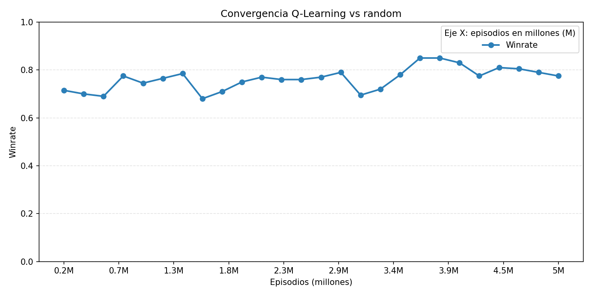

Figura: Win rate del agente entrenado en self-play evaluado contra el agente aleatorio.

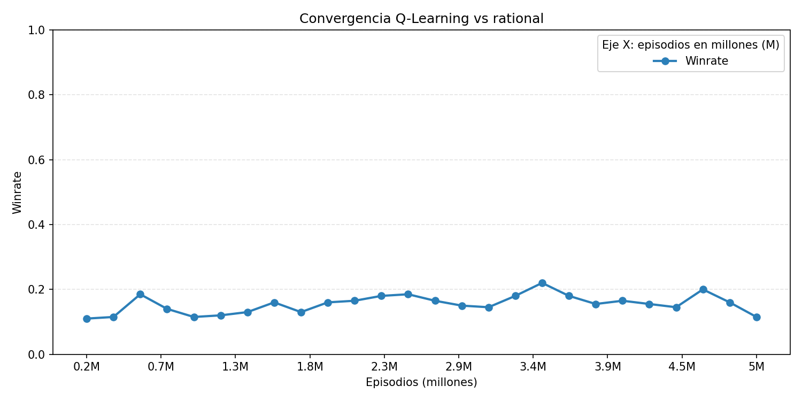

Figura: Win rate del agente entrenado en self-play evaluado contra el agente racional.

**Experimento 2: Entrenamiento contra agente racional**

Semilla 321123:

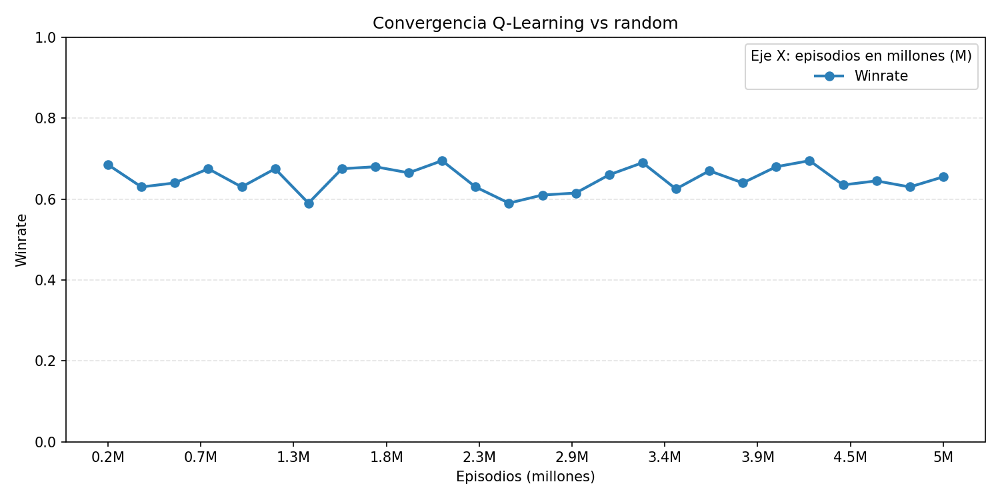

Figura: Win rate del agente (seed 321123) entrenado contra racional, evaluado contra el agente aleatorio.

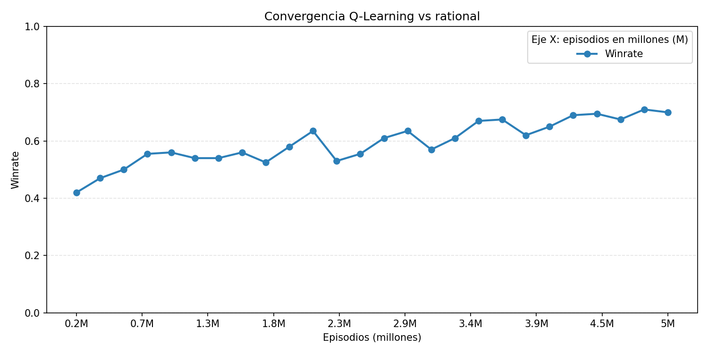

Figura: Win rate del agente (seed 321123) entrenado contra racional, evaluado contra el agente racional.

Semilla 789987:

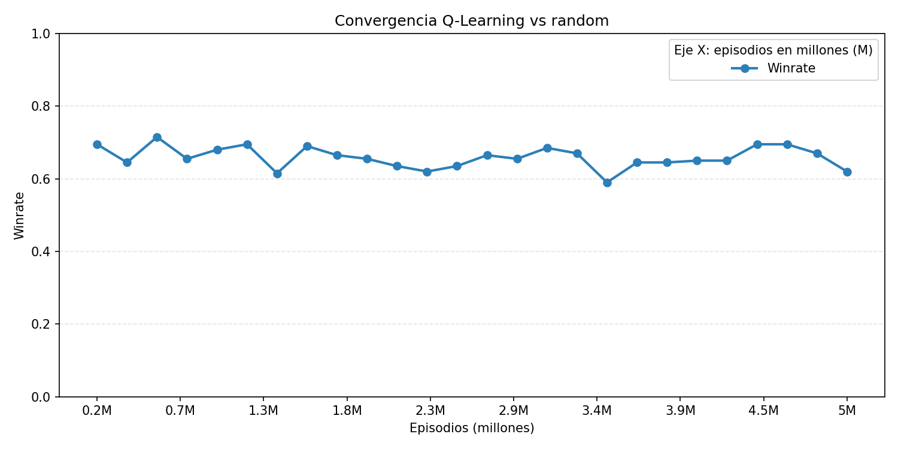

Figura: Win rate del agente (seed 789987) entrenado contra racional, evaluado contra el agente aleatorio.

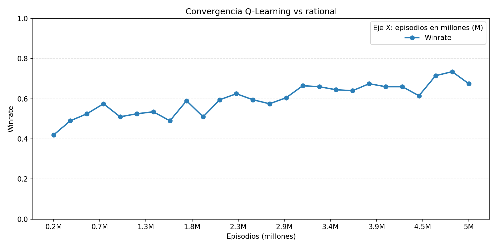

Figura: Win rate del agente (seed 789987) entrenado contra racional, evaluado contra el agente racional.

Ademas, se enfrentaron los dos agentes resultantes en 1000 partidas:

|                        | Seed 789987 (J0) | Seed 321123 (J1) |
| ---------------------- | ---------------- | ---------------- |
| Victorias              | 499              | 501              |
| Puntos promedio        | 22.02            | 22.14            |
| Manos ganadas promedio | 4.74             | 4.91             |

**Experimento 3: Entrenamiento mixto**

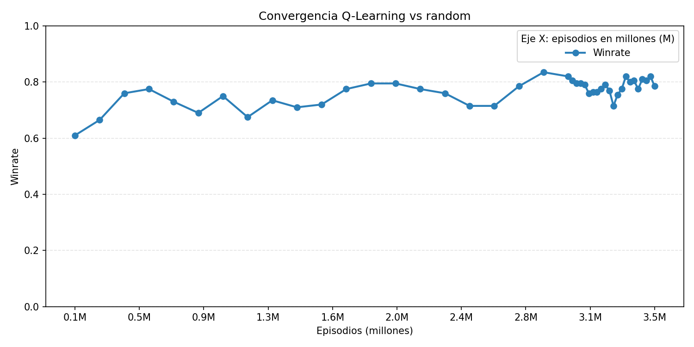

Figura: Win rate del agente mixto evaluado contra el agente aleatorio. La fase de self-play abarca los primeros 3M de episodios; a partir de ahí comienza el entrenamiento contra el agente racional.

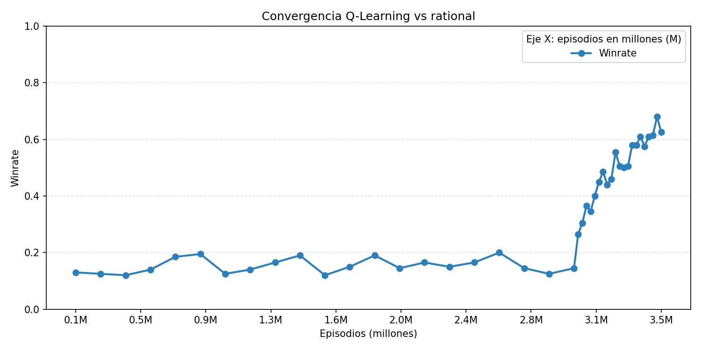

Figura: Win rate del agente mixto evaluado contra el agente racional. Se observa el salto de rendimiento al iniciar la segunda fase de entrenamiento contra el racional.

##### 4.1.1.3 Discusión y elección

**Experimento 1: Self-play puro.** El agente entrenado mediante self-play exhibe una convergencia marcadamente asimétrica frente a los dos oponentes heurísticos. Contra el agente aleatorio alcanza un win rate aproximado del 80%, lo cual se explica por la naturaleza del proceso de entrenamiento: durante las primeras iteraciones, cuando la Q-table aún no contiene información significativa, la política del agente es esencialmente aleatoria debido a la alta tasa de exploración (ε₀=0.5). En consecuencia, el self-play inicial equivale en la práctica a jugar contra un oponente aleatorio, lo que permite al agente aprender rápidamente a explotar las debilidades de este estilo de juego. Sin embargo, contra el agente racional el rendimiento es considerablemente inferior, alcanzando apenas un 20% de win rate en sus puntos más altos. Este resultado evidencia la limitación fundamental del self-play puro: al nunca enfrentarse a un oponente con estrategia estructurada, el agente no desarrolla la capacidad de responder ante un estilo de juego conservador y basado en reglas, radicalmente distinto al que experimenta durante su entrenamiento.

**Experimento 2: Entrenamiento contra agente racional.** Ambos agentes, entrenados con semillas distintas, exhiben trayectorias de convergencia similares: alcanzan aproximadamente un 70% de win rate tanto contra el agente aleatorio como contra el agente racional. A diferencia del self-play puro, el entrenamiento exclusivo contra un oponente racional produce un agente más equilibrado, capaz de competir razonablemente contra ambos estilos de juego. La equivalencia entre las dos políticas resultantes se confirma en el enfrentamiento directo entre ambos agentes (sección 4.1.1.2), donde el resultado de 499-501 en 1000 partidas (IC95% Wilson: [46.8%, 53.0%]) indica que la diferencia entre ambas semillas es compatible con el azar, ya que el intervalo contiene el 50%.

**Experimento 3: Entrenamiento mixto.** El win rate contra el agente aleatorio se mantiene estable en torno al 80% durante todo el entrenamiento, tanto en la fase de self-play como en la fase posterior contra el agente racional. Esto se explica por dos factores complementarios: durante el self-play, el agente aprende a explotar las estrategias agresivas e impredecibles propias de un oponente aleatorio, y al transicionar al entrenamiento contra el racional, este rendimiento no se deteriora, ya que un agente capaz de derrotar consistentemente a un oponente basado en reglas fijas conserva naturalmente su ventaja sobre un oponente sin estrategia. Contra el agente racional, en cambio, se observa una transición marcada: durante los primeros 3 millones de episodios en self-play, el rendimiento se mantiene en aproximadamente un 20% de win rate, consistente con lo observado en el Experimento 1. Sin embargo, al iniciar la segunda fase de entrenamiento contra el racional, el win rate escala rápidamente hasta alcanzar un 70% en apenas 500,000 episodios adicionales. Esta convergencia acelerada se atribuye al fenómeno de transferencia de conocimiento: la fase de self-play no solo enseña al agente a jugar contra sí mismo, sino que le permite construir una representación rica del espacio estado-acción del juego, aprendiendo la mecánica de las rondas, el valor relativo de las cartas, y la dinámica de las apuestas. Al enfrentarse posteriormente al agente racional, el agente no parte de cero; ya posee un conocimiento general del juego que solo necesita ser ajustado para responder a los patrones específicos de un oponente determinístico y predecible.

**Elección.** Para determinar qué política es globalmente más competitiva, se realizaron enfrentamientos directos entre los tres agentes resultantes (1000 partidas por par). La siguiente tabla muestra el win rate del agente en la fila contra el agente en la columna:

| Win rate (fila vs columna) | Exp. 1 (self-play) | Exp. 2 (vs racional) | Exp. 3 (mixto) |
| -------------------------- | ------------------ | -------------------- | -------------- |
| **Exp. 1 (self-play)**     | —                  | 53.6% [50.5, 56.7]   | 64.9% [61.9, 67.8] |
| **Exp. 2 (vs racional)**   | 46.4% [43.3, 49.5] | —                   | 53.7% [50.6, 56.8] |
| **Exp. 3 (mixto)**         | 35.1% [32.2, 38.1] | 46.3% [43.2, 49.4]  | —              |

_Nota: Los valores entre corchetes corresponden al IC95% Wilson (n=1000 partidas por enfrentamiento)._

A pesar de su pésima convergencia contra el agente racional, el agente del Experimento 1 obtiene una ventaja en los enfrentamientos directos. Esto se debe a que su política, forjada exclusivamente en self-play, desarrolla un repertorio estratégico más impredecible que incluye el uso frecuente de la mentira como herramienta ofensiva. En contraste, los agentes de los Experimentos 2 y 3, al haber sido parcial o totalmente entrenados contra el agente racional (que nunca miente), tienden a adoptar políticas más conservadoras y predecibles a la hora de responder, lo que los hace vulnerables ante un oponente con mayor variabilidad estratégica.

No obstante, la selección del agente final no debe basarse exclusivamente en el desempeño entre políticas Q-Learning, sino en la capacidad de generalización frente a distintos estilos de juego. En este sentido, el agente del Experimento 2 (racional) presenta el perfil más equilibrado: alcanza un 70% de win rate contra el agente aleatorio, contra el racional, y con una mínima desventaja contra políticas con mayor variabilidad estratégica. Dado que ambas semillas del Experimento 2 producen políticas con desempeño prácticamente idéntico (499-501 en enfrentamiento directo, IC95% Wilson: [46.8%, 53.0%], conteniendo el 50%), se selecciona la Q-table de la semilla 789987 como la política Q-Learning definitiva para las evaluaciones globales.

#### 4.1.2 Selección y ajuste de agente PPO

##### 4.1.2.1 Experimentos de convergencia

Se diseñaron tres experimentos para evaluar cómo la composición de la liga de oponentes (sección 2.4) influye en la calidad de la política aprendida por el agente PPO. Todos los experimentos utilizaron los mismos hiperparámetros descritos en la sección 3.5.3 y un total de 20,000,000 de timesteps, con snapshots generados cada 200,000 timesteps. La única variable entre los experimentos fue la distribución de probabilidades de selección de oponentes en la liga. Cada configuración se entrenó una sola vez, sin fijar una semilla explícita para el generador de números aleatorios, por lo que la inicialización de los pesos de la red y la secuencia de episodios dependieron del estado aleatorio del sistema. El modelo final seleccionado para cada experimento corresponde a la política obtenida al completar los 20M timesteps de entrenamiento.

**Experimento 1: Self-play puro con snapshots.** La liga se compone exclusivamente de self-play y versiones anteriores del modelo, sin oponentes heurísticos. El objetivo es evaluar si el agente es capaz de desarrollar una política competitiva a partir únicamente de su propia experiencia, maximizando la co-evolución entre la política actual y sus versiones pasadas.

| Tipo de oponente | Probabilidad |
| ---------------- | ------------ |
| Self-play        | 50%          |
| Snapshots        | 50%          |
| Heurísticos      | 0%           |

**Experimento 2: Distribución equilibrada.** La liga distribuye la exposición de forma más equitativa entre los tres tipos de oponentes, buscando un balance entre la exploración autónoma del self-play y la señal de aprendizaje estructurada que proveen los agentes heurísticos. Este diseño busca que el agente desarrolle una estrategia versátil, capaz de adaptarse tanto a estilos predecibles como impredecibles sin sobre-especializarse en ninguno.

| Tipo de oponente | Probabilidad                   |
| ---------------- | ------------------------------ |
| Self-play        | 30%                            |
| Snapshots        | 30%                            |
| Heurísticos      | 40% (20% random, 20% racional) |

**Experimento 3: Énfasis en oponentes heurísticos.** La mayor parte del entrenamiento se realiza contra los agentes aleatorio y racional, representando dos estilos de juego radicalmente opuestos: uno completamente impredecible y otro estrictamente basado en reglas. El self-play y los snapshots se mantienen con una participación reducida para permitir ajustes finos en la política. El objetivo es verificar si una exposición intensiva a ambos extremos del espectro estratégico produce una política que generalice mejor.

| Tipo de oponente | Probabilidad                   |
| ---------------- | ------------------------------ |
| Self-play        | 20%                            |
| Snapshots        | 20%                            |
| Heurísticos      | 60% (30% random, 30% racional) |

##### 4.1.2.2 Resultados de experimentos

**Experimento 1: Self-play puro con snapshots**

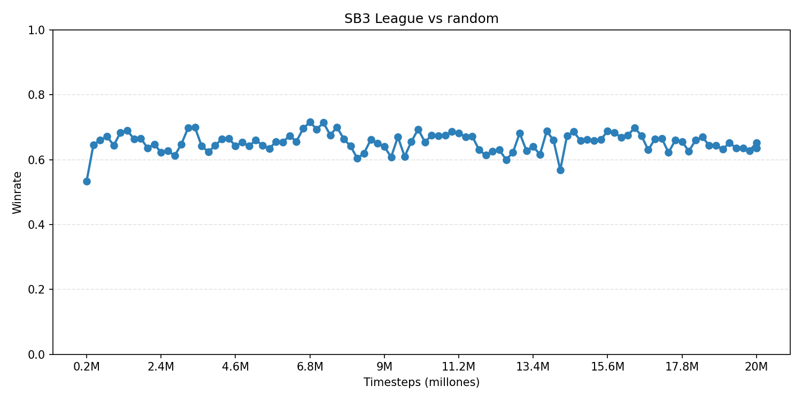

Figura: Win rate del agente PPO (self-play puro) evaluado contra el agente aleatorio a lo largo de 20M timesteps.

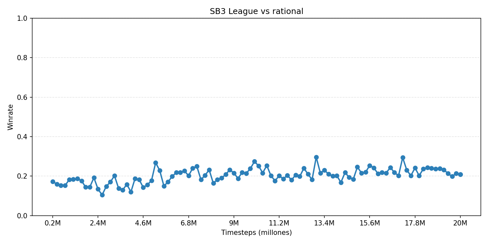

Figura: Win rate del agente PPO (self-play puro) evaluado contra el agente racional a lo largo de 20M timesteps.

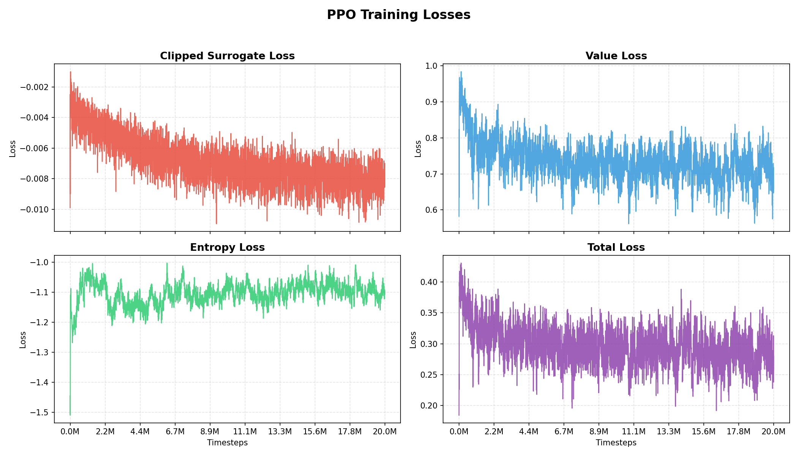

Figura: Evolución de las losses de entrenamiento del agente PPO (self-play puro). Se muestran la clipped surrogate loss, value loss, entropy loss y loss total a lo largo de 20M timesteps.

**Experimento 2: Distribución equilibrada**

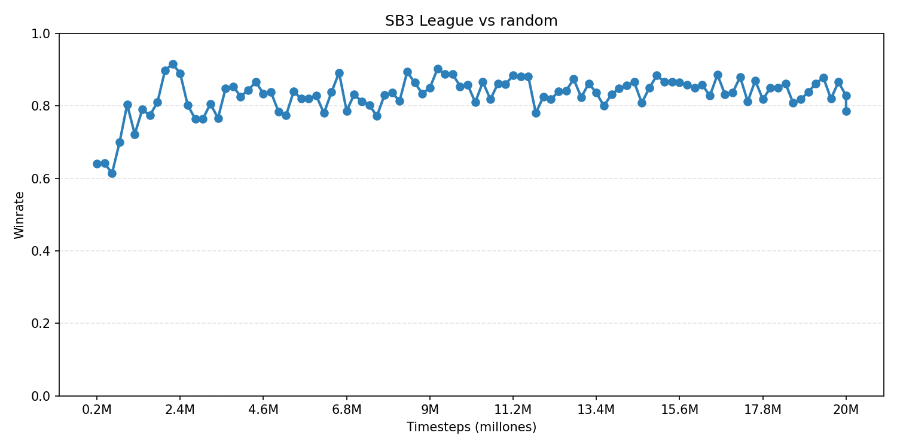

Figura: Win rate del agente PPO (distribución equilibrada) evaluado contra el agente aleatorio a lo largo de 20M timesteps.

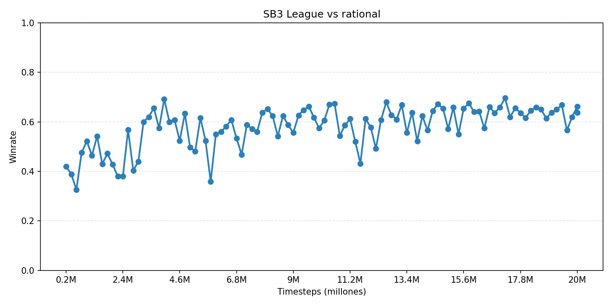

Figura: Win rate del agente PPO (distribución equilibrada) evaluado contra el agente racional a lo largo de 20M timesteps.

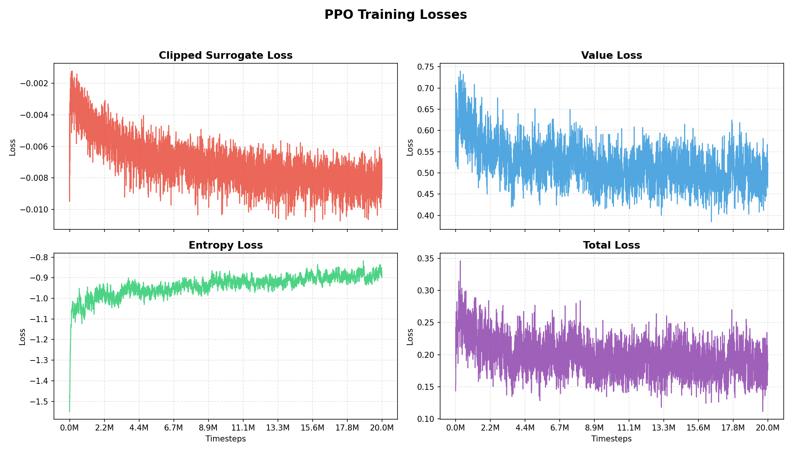

Figura: Evolución de las losses de entrenamiento del agente PPO (distribución equilibrada). Se muestran la clipped surrogate loss, value loss, entropy loss y loss total a lo largo de 20M timesteps.

**Experimento 3: Énfasis en oponentes heurísticos**

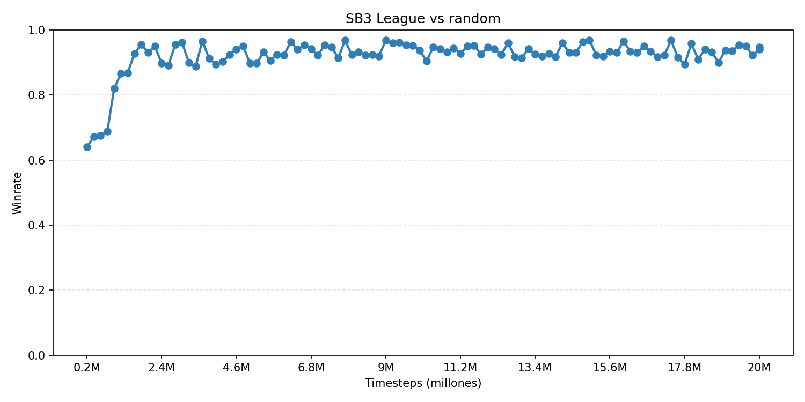

Figura: Win rate del agente PPO (énfasis en heurísticos) evaluado contra el agente aleatorio a lo largo de 20M timesteps.

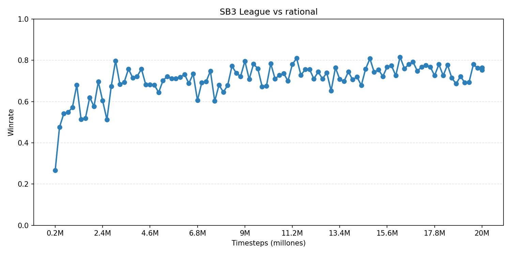

Figura: Win rate del agente PPO (énfasis en heurísticos) evaluado contra el agente racional a lo largo de 20M timesteps.

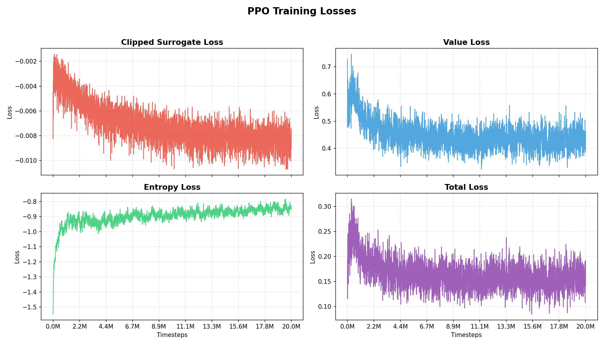

Figura: Evolución de las losses de entrenamiento del agente PPO (énfasis en heurísticos). Se muestran la clipped surrogate loss, value loss, entropy loss y loss total a lo largo de 20M timesteps.

##### 4.1.2.3 Discusión y elección

**Experimento 1: Self-play puro con snapshots.** El agente entrenado exclusivamente mediante self-play y snapshots alcanza un win rate estable pero moderado contra el agente aleatorio (~65%), y un desempeño muy pobre contra el agente racional (~20%). La ausencia total de oponentes heurísticos impide que el agente aprenda a explotar las debilidades del agente racional o a contrarrestar la impredecibilidad del agente aleatorio de forma efectiva. Las curvas de loss muestran convergencia: la value loss se estabiliza alrededor de 0.72 y la entropía oscila entre -1 y -1.1, valores menos optimos que los demas experimentos. Esto ultimo se debe a que el agente no consigue sacar una ventaja a su oponente, ya que este cambia permanentemente.

**Experimento 2: Distribución equilibrada.** La inclusión de un 40% de oponentes heurísticos produce una mejora drástica en la calidad de la política. El win rate contra el agente aleatorio asciende rápidamente a ~85% y se mantiene estable, mientras que contra el agente racional alcanza ~60% con una tendencia ascendente clara a lo largo del entrenamiento. Las losses reflejan esta mejora: la value loss converge a valores más bajos (~0.50) que en el Experimento 1, indicando una mejor estimación del valor de los estados, y la entropía se estabiliza alrededor de -0.90, mostrando una política más concentrada en acciones de alta calidad. La loss total decrece consistentemente hacia ~0.20, señal de un proceso de optimización saludable.

**Experimento 3: Énfasis en oponentes heurísticos.** El agente con mayor exposición a oponentes heurísticos (60%), como es de esperar, obtiene los mejores resultados en ambas evaluaciones. Contra el agente aleatorio converge rápidamente a un win rate de ~93%, el más alto de los tres experimentos. Contra el agente racional alcanza ~73%, superando ampliamente a los otros dos experimentos. La convergencia es además la más rápida: el agente alcanza win rates competitivos antes de los 2M timesteps y los mantiene con baja variabilidad durante el resto del entrenamiento. Las losses son las más bajas de los tres experimentos, con una value loss que desciende hasta ~0.45 y una loss total alrededor de 0.18, reflejando una estimación precisa del valor de los estados y una política altamente optimizada frente a los oponentes que el agente enfrenta en la liga.

**Elección.** La siguiente tabla resume el win rate final (promedio de los últimos 5M timesteps) de cada experimento contra ambos oponentes de evaluación:

| Experimento                         | vs Aleatorio | vs Racional |
| ----------------------------------- | ------------ | ----------- |
| **Exp. 1 (self-play puro)**         | ~65%         | ~20%        |
| **Exp. 2 (equilibrada)**            | ~85%         | ~60%        |
| **Exp. 3 (énfasis en heurísticos)** | ~93%         | ~73%        |

Los resultados muestran una correlación directa entre la proporción de oponentes heurísticos en la liga y la calidad de la política obtenida. El Experimento 1, sin exposición a oponentes heurísticos, produce el agente más débil: su política, forjada exclusivamente contra versiones de sí mismo, no logra generalizar a estilos de juego diferentes. El Experimento 2 demuestra que la inclusión de un 40% de heurísticos mejora sustancialmente el desempeño, pero el Experimento 3 confirma que una exposición aún mayor (60%) produce los mejores resultados en ambas métricas.

Esta tendencia se explica por la complementariedad de los oponentes heurísticos: el agente aleatorio enseña al agente PPO a no depender de patrones predecibles del rival, mientras que el agente racional proporciona una señal de aprendizaje estructurada que permite al agente desarrollar estrategias específicas para explotar el juego conservador y honesto. El self-play, aunque útil para la co-evolución, resulta insuficiente como fuente exclusiva de aprendizaje en un juego con información imperfecta como el truco.

Para complementar el análisis, se realizaron enfrentamientos directos entre los tres agentes resultantes (1000 partidas por par). La siguiente tabla muestra el win rate del agente en la fila contra el agente en la columna:

| Win rate (fila vs columna)          | Exp. 1 (self-play) | Exp. 2 (equilibrada) | Exp. 3 (heurísticos) |
| ----------------------------------- | ------------------ | -------------------- | -------------------- |
| **Exp. 1 (self-play)**              | —                  | 49.1% [46.0, 52.2]   | 55.7% [52.6, 58.8]   |
| **Exp. 2 (equilibrada)**            | 50.9% [47.8, 54.0] | —                    | 52.7% [49.6, 55.8]   |
| **Exp. 3 (énfasis en heurísticos)** | 44.3% [41.2, 47.4] | 47.3% [44.2, 50.4]  | —                    |

_Nota: Los valores entre corchetes corresponden al IC95% Wilson (n=1000 partidas por enfrentamiento)._

Los enfrentamientos directos revelan un resultado interesante: el Experimento 3, a pesar de dominar ampliamente contra los agentes heurísticos, presenta el peor desempeño en los duelos entre políticas PPO. Esto sugiere que su alta especialización contra oponentes heurísticos lo hace vulnerable frente a estrategias más impredecibles generadas por self-play. El Experimento 2 obtiene el mejor balance en enfrentamientos directos, superando tanto al Exp. 1 como al Exp. 3.

No obstante, la selección del agente final debe priorizar la capacidad de generalización frente a distintos estilos de juego. En este sentido, el Experimento 3 presenta el mejor desempeño global contra los oponentes heurísticos (~93% vs aleatorio, ~73% vs racional), superando a los otros dos experimentos. En los enfrentamientos directos, los ICs de Exp.1 vs Exp.2 ([46.0%, 52.2%]) y Exp.2 vs Exp.3 ([49.6%, 55.8%]) contienen el 50%, lo que indica que las diferencias no son distinguibles del azar con esta cantidad de partidas. Únicamente el enfrentamiento Exp.1 vs Exp.3 ([52.6%, 58.8%]) sugiere una ventaja leve del Exp.1 en duelos directos. Por esta razón, se selecciona la política del Experimento 3 como el agente PPO definitivo para las evaluaciones globales.

### 4.2 Resultados globales

#### 4.2.1 Resultados por agente

Para evaluar el desempeño final de los agentes desarrollados, se realizaron enfrentamientos de 1000 partidas entre cada par de agentes. Los modelos utilizados corresponden a las políticas finales seleccionadas en las secciones de experimentos internos: para Q-Learning, la Q-table del Experimento 2 con semilla 789987 (sección 4.1.1.3); para PPO, la política del Experimento 3 con distribución de liga 20/60/20 (sección 4.1.2.3). A continuación se presentan los resultados organizados por agente evaluado.

##### Agente Random

| Oponente   | Win Rate | Puntos Prom. | Manos Jugadas | Manos Ganadas | % Mentiras Truco | % Mentiras Envido |
| ---------- | -------- | ------------ | ------------- | ------------- | ---------------- | ----------------- |
| Rational   | 5.1% [3.9, 6.6]  | 8.37 ± 0.48  | 10.96 ± 0.43  | 2.62 ± 0.14   | 45%              | 64%               |
| Q-Learning | 33.9% [31.0, 36.9] | 15.62 ± 0.76 | 6.00 ± 0.30  | 1.16 ± 0.08   | 45%              | 62%               |
| PPO        | 6.6% [5.2, 8.3]  | 11.53 ± 0.47 | 11.21 ± 0.19  | 1.22 ± 0.07   | 49%              | 63%               |

_Nota: Los intervalos en Win Rate corresponden a IC95% Wilson. Para las demás métricas se reporta media ± 1.96 × error estándar (n=1000)._

##### Agente Racional

El agente racional implementa heurísticas diseñadas manualmente basadas en reglas del juego.

| Oponente   | Win Rate | Puntos Prom. | Manos Jugadas | Manos Ganadas | % Mentiras Truco | % Mentiras Envido |
| ---------- | -------- | ------------ | ------------- | ------------- | ---------------- | ----------------- |
| Random     | 94.9% [93.4, 96.1] | 28.95 ± 0.30 | 10.96 ± 0.43  | 8.35 ± 0.33  | 20%              | 0%                |
| Q-Learning | 30.6% [27.8, 33.5] | 23.88 ± 0.37 | 25.91 ± 0.24  | 12.80 ± 0.23 | 21%              | 0%                |
| PPO        | 23.8% [21.3, 26.5] | 20.12 ± 0.46 | 15.73 ± 0.31  | 5.56 ± 0.15  | 26%              | 0%                |

_Nota: Los intervalos en Win Rate corresponden a IC95% Wilson. Para las demás métricas se reporta media ± 1.96 × error estándar (n=1000)._

##### Agente Q-Learning

Política Q-Learning del Experimento 2 (sección 4.1.1.3), entrenada durante 5 millones de partidas exclusivamente contra el agente racional con semilla 789987.

| Oponente | Win Rate | Puntos Prom. | Manos Jugadas | Manos Ganadas | % Mentiras Truco | % Mentiras Envido |
| -------- | -------- | ------------ | ------------- | ------------- | ---------------- | ----------------- |
| Random   | 66.1% [63.1, 69.0] | 22.75 ± 0.69 | 6.00 ± 0.30  | 4.85 ± 0.24  | 40%              | 58%               |
| Rational | 69.4% [66.5, 72.2] | 28.25 ± 0.22 | 25.91 ± 0.24 | 13.11 ± 0.15 | 24%              | 55%               |
| PPO      | 21.8% [19.4, 24.5] | 18.69 ± 0.49 | 8.79 ± 0.23  | 3.56 ± 0.11  | 48%              | 56%               |

_Nota: Los intervalos en Win Rate corresponden a IC95% Wilson. Para las demás métricas se reporta media ± 1.96 × error estándar (n=1000)._

##### Agente PPO

Política PPO del Experimento 3 (sección 4.1.2.3), entrenada durante 20 millones de timesteps con liga de oponentes en distribución 20/60/20 (self-play, heurísticos, snapshots).

| Oponente   | Win Rate | Puntos Prom. | Manos Jugadas | Manos Ganadas | % Mentiras Truco | % Mentiras Envido |
| ---------- | -------- | ------------ | ------------- | ------------- | ---------------- | ----------------- |
| Random     | 93.4% [91.7, 94.8] | 28.73 ± 0.33 | 11.21 ± 0.19  | 9.98 ± 0.18  | 44%              | 55%               |
| Rational   | 76.2% [73.5, 78.7] | 25.98 ± 0.52 | 15.73 ± 0.31  | 10.17 ± 0.25 | 37%              | 58%               |
| Q-Learning | 78.2% [75.5, 80.6] | 25.61 ± 0.57 | 8.79 ± 0.23   | 5.24 ± 0.18  | 40%              | 57%               |

_Nota: Los intervalos en Win Rate corresponden a IC95% Wilson. Para las demás métricas se reporta media ± 1.96 × error estándar (n=1000)._

#### 4.2.2 Visualización de resultados

Los siguientes gráficos de violín muestran la distribución de puntos obtenidos por partida para cada enfrentamiento entre agentes. Cada violin representa la densidad de probabilidad de los puntajes finales, permitiendo observar no solo la tendencia central sino también la dispersión y la forma de la distribución. Los puntos individuales superpuestos corresponden a cada una de las 1000 partidas simuladas.

_Figura 1: Distribución de puntos por partida entre Random y Rational. Se observa la clara superioridad del agente Rational, con una distribución concentrada en valores altos._

_Figura 2: Distribución de puntos por partida entre Random y Q-Learning. El agente Q-Learning muestra una distribución favorable con mayor concentración en puntajes altos._

_Figura 3: Distribución de puntos por partida entre Random y PPO. Clara ventaja de PPO, donde gana la mayor parte de sus partidas cuando el agente random no ha superado los 10 puntos._

_Figura 4: Distribución de puntos por partida entre Rational y Q-Learning. Se observa un enfrentamiento ventajo hacia Q-Learnig. Un punto importante a notar es que este siempre paso los 10 puntos._

_Figura 5: Distribución de puntos por partida entre Rational y PPO. Enfrentamiento optimo para el agente PPO, dejando al Agente random mayormente por la mitad de la tabla._

_Figura 6: Distribución de puntos por partida entre Q-Learning y PPO. Se observa una ventaja del agente PPO. Notar que cuando este pierde, suele hacerlo por una cantidad considerable de puntos._

#### Fuentes de puntos por agente

Los siguientes gráficos de área apilada muestran el desglose de las fuentes de puntos obtenidos por los agentes de aprendizaje por refuerzo a lo largo de múltiples partidas. Las áreas representan la contribución de cada fuente: **Envido** (puntos ganados por cantos de envido), **Truco** (puntos ganados en manos donde se cantó truco), **Cartas** (puntos ganados en manos sin canto de truco), y **Abandono** (puntos ganados cuando el oponente se retira o rechaza un canto). Esta visualización permite observar cómo cada agente explota las diferentes mecánicas del juego para acumular puntos.

Para estos gráficos se utilizó una muestra de 100 partidas en lugar de las 1000 empleadas en las demás métricas. Esta decisión responde a criterios de legibilidad: al incrementar el número de partidas representadas, las áreas apiladas se comprimen y dificultan la apreciación de las proporciones relativas de cada fuente de puntos, perdiendo valor informativo. La muestra reducida preserva la claridad visual sin comprometer la representatividad de los patrones observados.

_Figura 7: Fuentes de puntos del agente Q-Learning contra diferentes oponentes. Se observa una distribución altamente enfocada en la explotación del envido._

_Figura 8: Fuentes de puntos del agente PPO contra diferentes oponentes. El agente muestra mayor taza de cantos en el truco, pero tambien aprovechando el envido de forma optima._

#### Comparación de tasas de mentira

El siguiente gráfico de barras compara las tasas de mentira de todos los agentes, calculadas a partir de los enfrentamientos entre ellos. Para cada agente se muestra el porcentaje de cantos realizados con mano desfavorable, tanto para **Truco** (cuando el promedio de fuerza de la mano es menor que la del oponente) como para **Envido** (cuando los puntos de envido son menores a 25). Esta métrica permite caracterizar el estilo de juego de cada agente en términos de agresividad y uso del mentiras.

_Figura 9: Comparación de tasas de mentira por agente. El agente Rational presenta las tasas más bajas (nunca miente en envido), mientras que Random muestran las tasas más altas, por su propia naturaleza. Q-Learning y PPO presentan un comportamiento intermedio._

#### Matrices de enfrentamientos

Las siguientes matrices de calor (heatmaps) resumen el rendimiento de cada agente contra todos los demás en un formato compacto. Cada celda representa el resultado del agente de la fila contra el agente de la columna.

El primer heatmap muestra el **win rate** (proporción de victorias) de cada enfrentamiento. Colores verdes indican un win rate alto (ventaja del agente de la fila), mientras que colores rojos indican un win rate bajo (desventaja).

_Figura 10: Matriz de win rate entre todos los agentes. Se observa que Rational domina contra Random (0.95), mientras que los enfrentamientos entre los agentes de RL y Rational tenemos como claro ganador a PPO._

El segundo heatmap muestra la **diferencia promedio de puntos** por partida. Valores positivos (rojo) indican que el agente de la fila obtiene en promedio más puntos que su oponente; valores negativos (azul) indican lo contrario.

_Figura 11: Matriz de diferencia promedio de puntos entre todos los agentes. Esta métrica complementa el win rate mostrando la magnitud de la ventaja o desventaja en cada enfrentamiento._

---

## 5. Análisis y discusión de resultados

A continuación se analiza el desempeño de cada agente en función de las tres métricas definidas: win rate, puntos promedio y porcentaje de mentiras.

### 5.1 Agente Random

El agente aleatorio sirve como línea base fundamental para evaluar el desempeño de los demás agentes. Su comportamiento, al seleccionar acciones uniformemente entre las opciones válidas, representa el rendimiento mínimo esperable sin ningún tipo de estrategia.

#### Win rate

El win rate del agente Random revela una clara jerarquía entre los oponentes. Contra el agente Rational obtiene apenas un 5.1% de victorias, lo que demuestra la efectividad de las heurísticas diseñadas manualmente frente a un comportamiento puramente aleatorio. Contra Q-Learning el win rate mejora a 33.9%, indicando que aunque Q-Learning aprendió estrategias superiores al azar, no logra la consistencia aplastante del agente Rational. Contra PPO, Random alcanza solo un 6.6% de victorias, prácticamente el mismo nivel que contra Rational. Esto demuestra que el agente PPO logró desarrollar una política altamente efectiva para explotar oponentes sin estrategia (ver Figura 3).

#### Puntos promedio y duración de partidas

Los puntos promedio por partida confirman la interpretación del win rate. Contra Rational, el agente Random obtiene solo 8.37 puntos promedio, siendo ampliamente superado. Contra Q-Learning mejora a 15.62 puntos, y contra PPO obtiene 11.53 puntos. La duración promedio de las partidas aporta información complementaria: contra Rational y PPO las partidas duran aproximadamente 11 manos, mientras que contra Q-Learning se resuelven en apenas 6 manos. Esto sugiere que Q-Learning cierra las partidas de forma más agresiva, posiblemente mediante un uso intensivo del envido y las apuestas de truco, mientras que Rational y PPO dominan de forma más gradual. El promedio de manos ganadas por Random es bajo en todos los casos (1.16–2.62), confirmando su incapacidad para competir a nivel táctico.

#### Porcentaje de mentiras

El agente Random presenta tasas de mentira del 45–49% en Truco y 62–64% en Envido, valores consistentes que reflejan la naturaleza probabilística de sus decisiones totalmente aleatorias, sin ningún patrón detectable. Estas tasas sirven como referencia: cualquier agente con tasas similares pero sin mejora en win rate estaría efectivamente comportándose como aleatorio en términos de estrategia de canto.

#### Conclusión

El agente Random cumple su rol como baseline al ser consistentemente superado por todos los agentes con estrategia. Tanto PPO como Rational logran win rates superiores al 93% contra él, mientras que Q-Learning alcanza 66.1%. La diferencia entre Q-Learning y los otros dos agentes sugiere que la discretización del espacio de estados limita la capacidad de explotar sistemáticamente a un oponente predecible por su aleatoriedad.

### 5.2 Agente Racional

El agente Racional implementa heurísticas diseñadas manualmente basadas en las reglas del Truco Argentino. Su estrategia es determinística y conservadora: solo canta cuando su mano lo justifica según umbrales predefinidos, y nunca miente en el envido.

#### Win rate

El agente Racional demuestra un rendimiento dominante contra el agente Random con un 94.9% de victorias, validando la efectividad de una estrategia básica pero coherente frente al azar. Sin embargo, contra los agentes de aprendizaje por refuerzo el panorama se invierte por completo: obtiene apenas un 30.6% contra Q-Learning y un 23.8% contra PPO. Estos resultados demuestran que ambos agentes de RL lograron aprender a explotar la predictibilidad del agente Racional, cuyo comportamiento determinístico y honesto se convierte en una desventaja frente a oponentes que pueden identificar y contrarrestar sus patrones (ver Figuras 4 y 5).

#### Puntos promedio y duración de partidas

Los puntos promedio reflejan la asimetría del rendimiento. Contra Random obtiene 28.95 puntos (cercano al máximo de 30), demostrando eficiencia en cerrar partidas rápidamente en aproximadamente 11 manos, de las cuales gana 8.35. Contra Q-Learning, los promedios caen a 23.88 puntos y las partidas se extienden considerablemente a 25.91 manos, la duración más larga de todos los enfrentamientos. Esto indica un desgaste táctico sostenido donde el agente Q-Learning logra neutralizar las ventajas heurísticas del Racional y acumular puntos gradualmente. Contra PPO las partidas duran 15.73 manos con solo 5.56 manos ganadas por el Racional, sugiriendo que PPO cierra las partidas de forma más decisiva que Q-Learning.

#### Porcentaje de mentiras

El aspecto más distintivo del agente Racional es su comportamiento honesto: presenta tasas de mentira del 20–26% en Truco y exactamente 0% en Envido. El porcentaje en Truco, si bien bajo comparado con los demás agentes, corresponde a situaciones donde las heurísticas permiten cantar pero la mano resulta ser inferior a la del oponente según la métrica de fuerza promedio. La ausencia total de mentiras en Envido es por diseño: el agente solo juega el envido cuando tiene 25 puntos o más, eliminando cualquier posibilidad de mentira según la definición de la métrica. Esta honestidad, que le otorga consistencia contra Random, se convierte en una señal explotable por los agentes de RL.

#### Conclusión

El agente Racional cumple un rol importante como referencia intermedia: domina al azar pero es ampliamente superado por ambos agentes de RL. Su caída frente a Q-Learning y especialmente frente a PPO demuestra que la predictibilidad de una estrategia determinística y honesta es una vulnerabilidad significativa en un juego donde la mentira es una herramienta legítima. Los agentes de RL aprendieron a explotar esta predictibilidad, validando la premisa de que el aprendizaje automático puede descubrir estrategias superiores a las heurísticas diseñadas manualmente en juegos con información imperfecta.

### 5.3 Agente Q-Learning

El agente Q-Learning representa el primer enfoque de aprendizaje por refuerzo implementado, utilizando una tabla de valores Q con discretización del espacio de estados. Su entrenamiento consistió en 5 millones de partidas exclusivamente contra el agente Racional (Experimento 2, sección 4.1.1.3), seleccionado por presentar el perfil más equilibrado frente a distintos estilos de juego.

#### Win rate

El agente Q-Learning muestra un rendimiento marcadamente asimétrico según el oponente. Contra Random obtiene un 66.1% de victorias, demostrando que efectivamente aprendió estrategias superiores al azar, aunque no con la contundencia de Rational o PPO. El resultado más destacado es contra el agente Rational, donde alcanza un 69.4% de victorias, explotando con éxito la predictibilidad del oponente determinístico (esto tiene sentido, por el experimento seleccionado). Sin embargo, contra PPO el rendimiento cae drásticamente a apenas 21.8%, revelando una clara limitación frente a un oponente con capacidad de generalización superior (ver Figuras 2 y 4).

#### Puntos promedio y duración de partidas

Los puntos promedio reflejan la dinámica de cada enfrentamiento: 22.75 contra Random, 28.25 contra Rational (el más alto de todos sus enfrentamientos) y 18.69 contra PPO. La duración de las partidas es especialmente reveladora: contra Random las partidas se resuelven en apenas 6 manos, la más corta de todos los enfrentamientos del estudio, lo que sugiere un uso agresivo del envido y las apuestas para cerrar partidas rápidamente. Contra Rational, las partidas se extienden a 25.91 manos con 13.11 manos ganadas, indicando un desgaste táctico prolongado donde Q-Learning logra acumular ventaja gradualmente. Contra PPO, las partidas duran 8.79 manos con solo 3.56 ganadas, mostrando que PPO cierra los enfrentamientos de forma contundente. El análisis de fuentes de puntos (Figura 7) revela una estrategia altamente enfocada en la explotación del envido, que le permite acumular puntos incluso en manos donde no tiene las mejores cartas.

#### Porcentaje de mentiras

Q-Learning presenta tasas de mentira del 24–48% en Truco y 55–58% en Envido, con una variación notable según el oponente. Contra Rational reduce su tasa de mentira en Truco al 24%, un comportamiento más conservador que refleja el ajuste aprendido durante el entrenamiento contra este oponente. Contra PPO, en cambio, la tasa sube al 48%, prácticamente al nivel del agente Random, sugiriendo que ante un oponente más impredecible el agente recurre a una estrategia más agresiva. Las tasas de mentira en Envido se mantienen relativamente estables (55–58%), indicando una estrategia de envido consistente independiente del oponente.

#### Conclusión

El agente Q-Learning demuestra que incluso con la limitación de una tabla Q discreta, el aprendizaje por refuerzo puede descubrir estrategias efectivas contra oponentes determinísticos. Su victoria contundente sobre Rational (69.4%) valida el enfoque de entrenamiento exclusivo contra el agente racional. Sin embargo, la caída abrupta contra PPO (21.8%) expone las limitaciones de la discretización del espacio de estados: frente a un oponente con capacidad de generalización a través de una red neuronal, la tabla Q no logra capturar los matices necesarios para competir. Su estrategia enfocada en el envido resulta efectiva para cerrar partidas rápidamente pero insuficiente contra un oponente que maneja todas las mecánicas del juego de forma más equilibrada.

### 5.4 Agente PPO

El agente PPO (Proximal Policy Optimization) representa el segundo enfoque de aprendizaje por refuerzo, utilizando una red neuronal como aproximador de función y entrenado mediante una liga de oponentes que combina self-play, snapshots y agentes heurísticos (distribución 20/60/20) a lo largo de 20 millones de timesteps.

#### Win rate

El agente PPO presenta el rendimiento más dominante de todos los agentes evaluados. Contra Random alcanza un 93.4% de victorias, comparable al rendimiento del agente Rational (94.9%), demostrando que logró desarrollar una política altamente efectiva para explotar oponentes sin estrategia. Contra Rational obtiene un 76.2%, superando ampliamente al agente heurístico y confirmando que la red neuronal aprendió a explotar la predictibilidad del oponente determinístico. Contra Q-Learning el dominio es igualmente claro con un 78.2%, estableciéndose como el agente más fuerte del estudio en todos los enfrentamientos (ver Figuras 3, 5 y 6).

#### Puntos promedio y duración de partidas

Los puntos promedio son consistentemente altos: 28.73 contra Random, 25.98 contra Rational y 25.61 contra Q-Learning, reflejando partidas donde PPO frecuentemente alcanza el objetivo de 30 puntos antes que su oponente. La duración de las partidas varía según el oponente de forma reveladora: contra Random y Rational las partidas duran 11.21 y 15.73 manos respectivamente, con un promedio de manos ganadas de 9.98 y 10.17, demostrando un dominio táctico sostenido. Contra Q-Learning las partidas se resuelven en apenas 8.79 manos con 5.24 ganadas, sugiriendo que PPO logra cerrar estos enfrentamientos de forma más eficiente, posiblemente al contrarrestar la estrategia enfocada en envido de Q-Learning. El análisis de fuentes de puntos (Figura 8) muestra un uso más diversificado de las mecánicas del juego en comparación con Q-Learning, aprovechando tanto el truco como el envido y los puntos por abandono del rival.

#### Porcentaje de mentiras

PPO presenta tasas de mentira del 37–44% en Truco y 55–58% en Envido, valores elevados pero notablemente inferiores a los del agente Random (45–49%/62–64%). El entrenamiento con la liga de oponentes (sección 2.4) produjo una política que miente de forma selectiva. La variación según el oponente es significativa: contra Rational la tasa de mentira en Truco baja al 37%, sugiriendo que el agente aprendió que mentir contra un oponente honesto y conservador es menos necesario, mientras que contra Random sube al 44%. En envido, las tasas se mantienen estables alrededor del 55–58%, por debajo del azar pero aún elevadas, indicando un uso estratégico de la mentira en esta mecánica.

#### Conclusión

El agente PPO se establece como el claro ganador del estudio, dominando todos los enfrentamientos con win rates superiores al 76%. Su arquitectura basada en red neuronal, combinada con el entrenamiento mediante liga de oponentes, le permitió desarrollar una política que generaliza efectivamente ante distintos estilos de juego. A diferencia de Q-Learning, que se especializa en explotar oponentes determinísticos, PPO mantiene un rendimiento alto y consistente independientemente del rival. Su uso diversificado de las mecánicas del juego y su tasa de mentira moderada pero estratégica reflejan una política sofisticada que equilibra agresividad y prudencia de forma adaptativa.

---

## 6. Conclusiones finales

El desarrollo de agentes de inteligencia artificial para el Truco Argentino representa un desafío que trasciende la mera implementación de algoritmos de aprendizaje por refuerzo. El juego combina información imperfecta, estocasticidad en el reparto de cartas, y un componente psicológico fundamental: la mentira como herramienta estratégica válida. Esta combinación genera un escenario donde no existe una estrategia óptima universal.

### Sobre la naturaleza estocástica del juego

A diferencia de juegos determinísticos como el ajedrez o el Go, el Truco Argentino introduce variabilidad irreducible desde el momento del reparto. Un agente puede ejecutar la decisión teóricamente correcta y aun así perder debido a la distribución de cartas. Esta característica implica que nunca se conseguirá un win rate absoluto: incluso el mejor agente posible perdería partidas por factores fuera de su control. Los resultados experimentales confirman esta realidad: aunque el agente PPO logró dominar consistentemente a todos los demás oponentes, sus win rates se mantuvieron por debajo del 100%, con el enfrentamiento más favorable (93.4% contra Random) aún dejando un margen de derrotas atribuible a la estocasticidad inherente del reparto.

La mentira añade otra capa de complejidad. Un canto de truco o envido no transmite información verdadera sobre la mano del jugador, sino que es una apuesta estratégica que debe evaluarse considerando el historial del oponente, el contexto de la partida, y la tolerancia al riesgo. Los agentes desarrollados mostraron diferentes filosofías respecto a esta herramienta: mientras el Racional la evita casi completamente con un 0% de mentiras en envido, PPO la utiliza de forma selectiva con tasas moderadas (37–44% en truco), y Q-Learning adopta un comportamiento variable según el oponente (24–48% en truco).

### Sobre la evaluación de agentes

Una conclusión importante de este trabajo es que no existe mejor forma de evaluar el comportamiento de un agente que jugando contra él. Las métricas cuantitativas (win rate, puntos promedio, duración de partidas, manos ganadas y tasa de mentira) proporcionan una caracterización multidimensional que, tomadas en conjunto, revelan el estilo y la efectividad de cada agente. Los gráficos de violin (Figuras 1-6) ilustran la variabilidad inherente a cada enfrentamiento, mostrando distribuciones de resultados que no pueden resumirse en un único número.

Esta observación tiene implicaciones prácticas: aunque PPO logró dominar todos los enfrentamientos, su rendimiento varía significativamente según el oponente (93.4% vs Random frente a 76.2% vs Rational), y la duración de las partidas revela dinámicas tácticas distintas en cada caso. La verdadera prueba de un agente de Truco es su capacidad de mantener competitividad ante estilos de juego diversos, criterio que el agente PPO cumple de forma consistente.

### Logros y limitaciones

Se logró implementar un entorno de simulación completo del Truco Argentino, compatible con Gymnasium y extensible para futuras investigaciones. El agente PPO, entrenado mediante una liga de oponentes con distribución 20/60/20 (self-play, heurísticos, snapshots), demostró ser claramente superior a todos los demás agentes, incluyendo el basado en heurísticas manuales. Con win rates del 76–93% contra todos los oponentes, PPO valida que el aprendizaje por refuerzo con redes neuronales puede descubrir estrategias efectivas en juegos de información imperfecta, superando tanto las heurísticas diseñadas manualmente como las tablas Q discretas. El agente Q-Learning, si bien limitado por la discretización del espacio de estados, también logró superar al agente Racional (69.4%), demostrando que incluso enfoques tabulares pueden aprender a explotar oponentes con enfoque unico.

### Trabajo futuro

#### Agente adaptativo con múltiples políticas

Una línea de mejora prometedora consiste en desarrollar un agente que no dependa de una única política fija, sino de un conjunto de políticas especializadas para diferentes estilos de oponente. Este agente incorporaría un motor de clasificación basado en aprendizaje automático que recolecte datos durante la partida (frecuencia de cantos, tasas de aceptación, patrones de juego de cartas) y estime el estilo del contrincante en tiempo real. Con esta clasificación, el agente seleccionaría dinámicamente la política más adecuada: una conservadora contra oponentes agresivos, una agresiva contra oponentes pasivos, etc. Este enfoque reconoce que cada jugador es un mundo y que la adaptación durante la partida es clave para el éxito en el Truco.

#### Algoritmos de minimización de arrepentimiento contrafactual (CFR)

Los algoritmos de la familia CFR [4] (Counterfactual Regret Minimization) representan el estado del arte para juegos de información imperfecta y suma cero. A diferencia de los métodos de aprendizaje por refuerzo tradicionales, CFR converge hacia un equilibrio de Nash aproximado, garantizando una estrategia no explotable a largo plazo. Esta familia de algoritmos ha demostrado resultados sobresalientes en dominios similares al Truco:

- **Libratus** (Carnegie Mellon University, 2017) [7]: Derrotó a jugadores profesionales de póker heads-up no-limit Texas Hold'em utilizando Monte Carlo CFR (MCCFR) y CFR+.
- **Pluribus** (Facebook AI Research & CMU, 2019) [6]: Extendió el éxito a póker de seis jugadores, demostrando la escalabilidad del enfoque.

Durante el desarrollo de este proyecto se intentó implementar diversas variantes de CFR a traves de la libreria OpenSpiel [5] para el Truco Argentino:

- **Vanilla CFR:** La versión original requiere recorrer el árbol de juego completo en cada iteración, resultando computacionalmente inviable para el tamaño del espacio de estados del Truco.
- **Outcome Sampling CFR:** Variante más ligera que muestrea trayectorias en lugar de recorrer todo el árbol. A pesar de reducir significativamente los requisitos computacionales, no logró converger hacia una estrategia óptima con los recursos disponibles.
- **Deep CFR:** Combina CFR con redes neuronales para aproximar los valores de arrepentimiento. Los requerimientos de memoria y tiempo de entrenamiento excedieron la capacidad temporal del proyecto.
- **NeuRD (Neural Replicator Dynamics):** Enfoque alternativo basado en dinámica de replicadores. Presentó problemas de estabilidad numérica y tampoco convergió satisfactoriamente.

La conclusión es que, aunque CFR es teóricamente el enfoque más adecuado para el Truco, su implementación práctica requiere recursos computacionales sustancialmente mayores a los disponibles para este proyecto. Trabajo futuro podría explorar implementaciones optimizadas, abstracciones del espacio de estados, o acceso a infraestructura de cómputo de alto rendimiento.

---

## Nota sobre el uso de herramientas de IA

La redacción y estructuración de este documento fue asistida por el modelo de lenguaje Claude Opus 4.6 (Anthropic, 2026).

---

## 7. Referencias

[1] Wang, H., Emmerich, M., & Plaat, A. (2018). _Monte Carlo Q-learning for General Game Playing_. arXiv preprint arXiv:1802.05944. Recuperado de https://arxiv.org/abs/1802.05944

[2] Huang, S., & Ontañón, S. (2022). _A Closer Look at Invalid Action Masking in Policy Gradient Algorithms_. The International FLAIRS Conference Proceedings, 35. Recuperado de https://arxiv.org/abs/2006.14171

[3] Stable-Baselines3 Contributors. (2024). _MaskablePPO Documentation_. sb3-contrib. Recuperado el 2 de febrero de 2026, de https://sb3-contrib.readthedocs.io/en/master/modules/ppo_mask.html

[4] Neller, T. W., & Lanctot, M. (2013). _An Introduction to Counterfactual Regret Minimization_. Technical Report.

[5] DeepMind. (2024). _OpenSpiel: A Framework for Reinforcement Learning in Games_. Recuperado el 3 de febrero de 2026, de https://openspiel.readthedocs.io/en/latest/index.html

[6] Brown, N., & Sandholm, T. (2019). _Superhuman AI for multiplayer poker_. Science, 365(6456), 885-890. DOI: 10.1126/science.aay2400

[7] Brown, N., & Sandholm, T. (2018). _Superhuman AI for heads-up no-limit poker: Libratus beats top professionals_. Science, 359(6374), 418-424. DOI: 10.1126/science.aao1733

[8] Farama Foundation. (2024). _Gymnasium: Create Custom Environments_. Recuperado el 3 de febrero de 2026, de https://gymnasium.farama.org/introduction/create_custom_env/

[9] Russell, S., & Norvig, P. (2020). _Artificial Intelligence: A Modern Approach_ (4th ed.). Pearson.

[10] Raoof, O., & Al-Raweshidy, H. (2011). _Theory of Games: An Introduction_. InTech. DOI: 10.5772/32940

[11] Schulman, J., Wolski, F., Dhariwal, P., Radford, A., & Klimov, O. (2017). _Proximal Policy Optimization Algorithms_. arXiv preprint arXiv:1707.06347. Recuperado de https://arxiv.org/abs/1707.06347

[12] Asociación Argentina de Truco (ASART). (2017). _Reglamento de Juego_.

[13] Mnih, V., Badia, A. P., Mirza, M., Graves, A., Lillicrap, T., Harley, T., Silver, D., & Kavukcuoglu, K. (2016). _Asynchronous Methods for Deep Reinforcement Learning_. Proceedings of the 33rd International Conference on Machine Learning (ICML), 48, 1928–1937. Recuperado de https://arxiv.org/abs/1602.01783

[14] Vinyals, O., Babuschkin, I., Czarnecki, W. M., Mathieu, M., Dudzik, A., Chung, J., Choi, D. H., Powell, R., Ewalds, T., Georgiev, P., Oh, J., Horgan, D., Kroiss, M., Danihelka, I., Huang, A., Sifre, L., Cai, T., Agapiou, J. P., Jaderberg, M., … Silver, D. (2019). _Grandmaster level in StarCraft II using multi-agent reinforcement learning_. Nature, 575(7782), 350–354. DOI: 10.1038/s41586-019-1724-z

[15] Silver, D., Schrittwieser, J., Simonyan, K., Antonoglou, I., Huang, A., Guez, A., Hubert, T., Baker, L., Lai, M., Bolton, A., Chen, Y., Lillicrap, T., Hui, F., Sifre, L., van den Driessche, G., Graepel, T., & Hassabis, D. (2017). _Mastering the game of Go without human knowledge_. Nature, 550(7676), 354–359. DOI: 10.1038/nature24270

[16] Heinrich, J., & Silver, D. (2016). _Deep Reinforcement Learning from Self-Play in Imperfect-Information Games_. arXiv preprint arXiv:1603.01121. Recuperado de https://arxiv.org/abs/1603.01121
